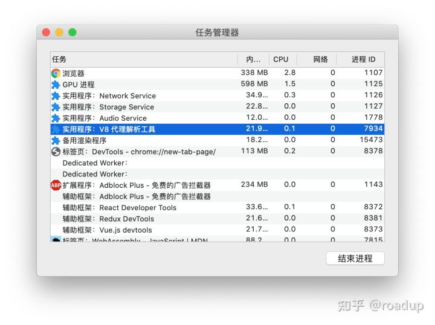
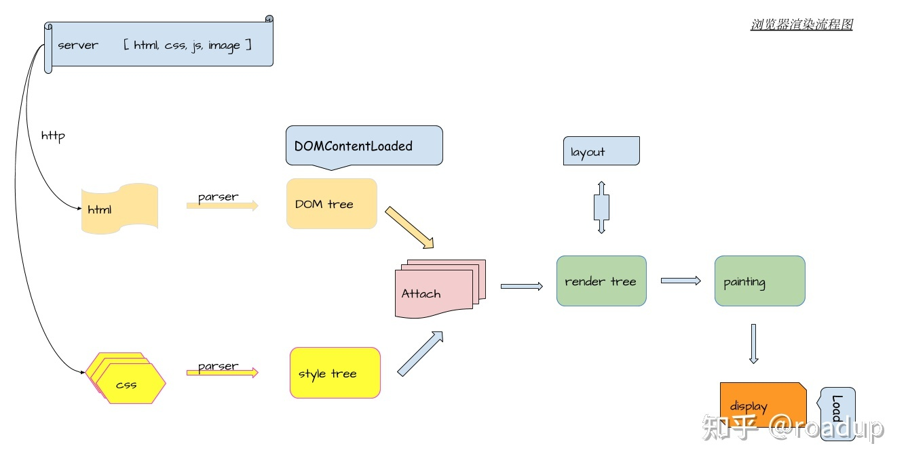
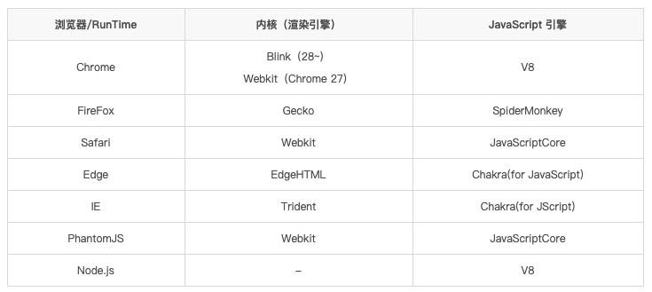
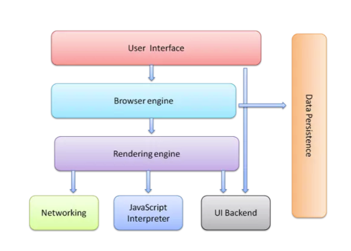

# 浏览器工作原理
* [基本概念](#基本概念)
    - [进程和线程](#进程和线程)
    - [浏览器是多进程的](#浏览器是多进程的)
    - [浏览器内核](#浏览器内核)
    - [浏览器渲染流程](#浏览器渲染流程)
    - [JS运行机制](#JS运行机制)

* [进阶](#进阶)
    - [浏览器内核中线程的关系](#浏览器内核中线程的关系)
    - [浏览器渲染中的普通图层和复合图层](#浏览器渲染中的普通图层和复合图层)
* [常见问题](#常见问题)
* [参考资料](#参考资料)  

## 基本概念

### 进程和线程
如何区分进程和线程

进程有自己独立的资源,包括内存、堆栈等, 进程之间相互独立. 线程属于进程, 一个进程中至少包含一个线程, 一个进程中的多个线程共享进程的资源.

在电脑中可以打开任务管理器( mac 中叫活动监视器 ), 可以看到一个进程列表. 同时还能看到进程对系统资源的占用情况

**进程是CPU资源分配的最小单位.线程是CPU调度的最小单位, 线程是建立在进程基础上的一次程序运行单位.**

不同进程之间也可以通信, 不过代价比较大.

现在通常所说的单线程和多线程,都是指的一个进程内的.

### 浏览器是多进程的
浏览器是多进程的, 通常来说一个页面对应着一个进程

浏览器之所以能够运行, 是因为操作系统给它提供了所需要的资源, 如内存、 CPU等

浏览器中也包含一个类似于任务管理器的工具, 在Chrome中可以通过菜单->更多工具->任务管理器打开.

**浏览器包含的进程**

* Browser进程: 浏览器的主进程, 负责协调和控制浏览器, 只有一个.
    - 负责浏览器界面的显示, 与用户交互, 如前进后退等
    - 负责各个页面的管理, 创建和销毁其他进程
    - 将Renderer进程得到的内存中的图片绘制到用户界面上
    - 网络资源的管理、下载等
* 第三方插件进程: 每个插件对应一个进程, 仅当使用该插件时才会创建
* GPU进程: 最多一个, 用于3D图像的绘制
* 浏览器渲染进程: 也是浏览器内核进程、 Renderer进程, 通常每个页面一个进程, 互相隔离, 用于页面渲染、执行脚本、处理各种事件等.

### 浏览器内核
浏览器内核进程也是Renderer进程.

可以认为页面的渲染、JS的运行、事件循环都在这个进程内

浏览器的渲染进程是多线程的, 内核进程中通常包含以下线程:

* GUI线程
    - 负责渲染页面, 解析HTML、CSS构建DOM树和RenderObject结构, 布局和绘制等
    - 页面需要重绘或回流时, 该线程就会执行
    - GUI线程与JS引擎线程互斥.
* JS引擎线程, JS内核
    - 负责执行JS脚本, 如v8
    - 解析JavaScript脚本, 执行代码
    - 每个Tab页只有一个JS线程
* 事件线程
    - 归属于浏览器而不是JS引擎, 用来控制事件循环
    - 当遇到需要异步执行的代码时, 会将相应的事件添加到事件队列中
* 定时器线程
    - setTimeout 和 setInterval 所在线程
    - 浏览器的定时器并不是由JS引擎计数的, 因为JS引擎是单线程, 如果处于阻塞状态会影响计时的准确性
    - 计时完毕后,定时器线程会将事件添加到事件队列中,等待JS引擎空闲后执行
    - W3C规范要求setTimeout的最小时间间隔为4ms
* HTTP请求线程
    - 用于开启HTTP请求
    - 当检测到请求状态变更时, 如果有设置回调函数,则会产生相应的事件.

### 浏览器渲染流程
浏览器内核拿到请求的内容后, 大致可以划分为几个步骤

1. 解析html建立dom树
2. 解析css构建render树
3. 计算render布局, 负责计算各个元素的尺寸、位置等
4. 绘制页面, 计算每个像素的信息
5. 将各个图层进行合成, 显示在屏幕上

渲染完成后就是触发load事件, 执行js脚本

#### load事件与DOMContentLoaded
当DOM加载完成, 会触发DOMCOntentLoaded事件, 不包括样式表 图片等.

当页面上的所有的DOM、 样式、 脚本、图片都加载完成时, 会触发load事件

[DOMContentLoaded事件一定早于onload吗???](https://cloud.tencent.com/developer/article/1124484)

#### css加载与DOM树渲染
css加载不会阻塞DOM树的解析, 加载过程中DOM正常构建, 但会阻塞render树的渲染, 因为render树的构建是依赖css.

如果不阻塞的话, 当css加载完成后,render树可能需要需要重绘甚至回流, 造成没有必要的损耗.

### JS运行机制
* JS引擎
* 事件线程
* 定时器线程

JS分为同步任务和异步任务

同步任务都在主线程上执行, 形成一个执行栈

主线程之外, 事件触发线程管理这一个任务队列,只要异步任务有了运行结果, 就在任务队列中放置一个事件. 一旦执行栈中所有的同步任务执行完毕, 系统就会读取任务队列, 将可运行的异步任务添加到执行栈中, 开始执行.

这也可以解释了为什么浏览器定时器是有误差的了, 因为定时器结束时只是将任务推送到事件队列中, 此时的执行栈还有别的任务, 因此需要等到这些任务完成之后, 才会开始执行定时器的任务.

#### 事件循环
主线程执行时会产生执行栈, 栈中的代码在产生异步任务时, 会在任务队列中添加各种事件, 如定时器, 网络请求等

栈中的代码执行完毕时, 会从任务队列中获取任务来执行,继而产生循环.

#### 定时器
事件循环机制的核心是Js引擎线程和事件触发线程

定时器是有定时器线程控制的, 当调用setTimeout或setInterval时, 计时器就开始计时, 计时完成后会将指定的回调添加到任务队列中, 等待主线程执行.

用setTimeout模拟定期计时和直接使用setInterval是有区别的, 因为每次setTimeout计时结束后会执行代码, 然后才会设定新的计时器. 中间会有误差. 而setInterval则每次都会在精确的之后推入事件, 当事件的执行就不一定准确了, 有可能上一个事件还没执行, 下一个事件就来了. 这就是setInterval的累积效应, 会导致代码执行很多次, 而且之间没有间隔.

因此, 一般会建议使用setTimeout模拟setInterval, 或者在做动画时使用requestAnimationFrame.

#### 微任务与宏任务
https://jakearchibald.com/2015/tasks-microtasks-queues-and-schedules/

宏任务: 可以理解是每次执行栈的代码就是一个宏任务. 每一个task会从头到尾执行, 不会执行其他的代码. 浏览器为了能够使得JS内部task与DOM任务能有序的执行,会在一个task执行结束后, 下一个 task 执行之前, 对页面进行想重新渲染.

常见的宏任务有setTimeout、 setInterval、MessageChannel, 并且MessageChannel的优先级大于setTimeout

宏任务是由事件线程维护

微任务: 可以理解为在当前task结束后立即执行的任务, 也就是说, 在当前task任务后, 下一个task之前执行, 因此它比setTimeout会更快, 因为无序等待渲染.

常见的微任务有Promise、process.nextTick ( 在node环境下, process.nextTick的优先级会高于Promise, 先于Promise执行 )

微任务由JS引擎维护

官方的Promise是micro task, polyfill版本是宏任务, 是通过setTimeout模拟的

## 进阶
### 浏览器内核中线程的关系
#### GUI渲染线程与JS引擎线程互斥
由于JavaScript可以操作DOM, 如果在修改元素的同时渲染页面, 那么渲染前后元素的数据可能不一致. 为了防止渲染出现不可预期的结果, 浏览器设置了GUI和Js引擎互斥的关系, 当其中一个执行的时候, 另外一个会被挂起.

#### JS阻塞页面
当JS长时间执行的时候, 由于GUI线程被挂起, 此时就算GUI有更新,也会被保存在队列中,等待JS空闲后再渲染. 如果JS由于大量的计算, 需要很长时间才能空闲的话, GUI就会长时间不能更新页面, 自然就感觉页面卡顿. 因此要避免JS长时间占用, 导致页面卡顿.

React 在更新过程中会有大量的计算, 因此React在16版本之后使用了异步渲染的方式, 让更新过程可以暂停, 使得GUI能有机会更新页面, 从而防止页面卡顿.

#### WebWorker, JS的多线程
为了让JS能应对CPU密集型计算任务, 在HTML5中加入了WebWorker.

Web Worker 为内容在后台线程中运行脚本提供了一种简单的方法. 线程可以执行任务而不干扰用户界面. 此外也可以使用网络请求执行I/O. 一旦创建, 一个worker可以将消息发送到它的父线程, 反之亦然.

worker运行在另一个全局上下文中, 不同于主线程的window, 因此在worker中使用window将会返回错误

创建worker时, JS引擎向浏览器申请新开一个子线程( 子线程是浏览器开的, 完全受主线程控制, 并且不能操作dom ).

JS引擎线程与worker线程间通过特定的方式通信, 需要序列化对象来与线程进行特定数据的交互.

虽然我们可以通过web worker 来开启新的线程, 但JS引擎的单线程本质并没有改变.

#### WebWorker和SharedWorker
区别

WebWorker只属于某个页面, 不会和其他页面的进程共享

SharedWorker是所有页面共享的, 属于浏览器进程

### 浏览器渲染中的普通图层和复合图层
浏览器渲染的图层包含两类, 普通图层和复合图层

普通文档流可以理解为一个复合图层(默认复合层), 使用absolute 、fixed定位的元素通常也在这个图层里.

当我们使用硬件加速的方式声明一个新的复合图层时, 这个图层后单独分配资源, 这个图层里面引起的回流重绘不会影响默认复合层.

可以认为: GPU中, 各个图层是单独绘制的, 所以互不影响. 这也是为什么某些场景下硬件加速的效果非常好

可以在Chrome的调试工具中找到图层工具, 查看页面元素的图层信息

#### 硬件加速
将该元素变成一个复合图层,  就是传说的硬件加速技术
* 最常用的方式: translate3d, translateZ
* opacity 属性/过渡动画 需要执行的过程中才会创建复合层, 动画没有开始或结束后还会回到之前的状态
* will-change属性, 一般配合opacity与translate使用. 作用是提前告诉浏览器这个元素可能会变化, 浏览器会提前做一下优化工作
* video/iframe/canvas/webgl 等元素
* 其它一些插件, 比如flash

#### absolute和硬件加速的区别
absolute虽然可以脱离普通文档流, 当没有脱离默认复合层

所以, 即使absolute的信息改变不会改变普通文档流中render树, 但是, 浏览器最终绘制时, 是整个复合层绘制的, 而硬件加速就直接在另一个复合层绘制, 因此这个复合层的绘制不会影响默认复合层, 仅仅引起最后的合成.

#### 复合图层的作用

一般一个元素开启硬件加速后会变成复合图层, 可以独立于普通文档流中, 改变后可以避免整个页面的重绘, 提升性能.

但是尽量不要大量使用复合图层, 否则由于资源消耗过渡, 页面反而会变得更卡.

#### 硬件加速时请使用index
使用硬件加速时, 尽可能使用index, 防止浏览器默认给后续元素创建复合层渲染

如果这个元素添加了硬件加速, 并且index层级比较低, 那么这个元素的后面其他元素, 会变成复合层渲染, 如果处理不当会引起极大的性能问题.

简单来说, 如果A是一个复合图层, 并且B在A上面, 那么B也会被隐式转为一个复合图层.

## 常见问题
* 常见的浏览器内核有哪些?

* 浏览器的主要组成部分是什么？
    1. 用户界面 - 包括地址栏、前进/后退按钮、书签菜单等。除了浏览器主窗口显示的您请求的页面外，其他显示的各个部分都属于用户界面。
    
    2. 浏览器引擎 - 在用户界面和呈现引擎之间传送指令。
    
    3. 呈现引擎 - 负责显示请求的内容。如果请求的内容是 HTML，它就负责解析 HTML 和 CSS 内容，并将解析后的内容显示在屏幕上。
    
    4. 网络 - 用于网络调用，比如 HTTP 请求。其接口与平台无关，并为所有平台提供底层实现。
    
    5. 用户界面后端 - 用于绘制基本的窗口小部件，比如组合框和窗口。其公开了与平台无关的通用接口，而在底层使用操作系统的用户界面方法。
    
    6. JavaScript 解释器。用于解析和执行 JavaScript 代码。
    
    7. 数据存储。这是持久层。浏览器需要在硬盘上保存各种数据，例如 Cookie。新的 HTML 规范 (HTML5) 定义了“网络数据库”，这是一个完整（但是轻便）的浏览器内数据库。

    
* 浏览器如何解析css选择器？
    浏览器会『从右往左』解析CSS选择器。
    
    我们知道DOM Tree与Style Rules合成为 Render Tree，实际上是需要将Style Rules附着到DOM Tree上，因此需要根据选择器提供的信息对DOM Tree进行遍历，才能将样式附着到对应的DOM元素上。

* 浏览器渲染的步骤
    - HTML 解析出 DOM Tree
    - CSS 解析出 Style Rules
    - 两者关联生成 Render Tree
    - Layout（布局）根据 Render Tree 计算每个节点的信息
    - Painting 根据计算好的信息进行渲染整个页面
* 浏览器重绘与重排的区别？
    - 重排: 部分渲染树（或者整个渲染树）需要重新分析并且节点尺寸需要重新计算，表现为重新生成布局，重新排列元素
    
    - 重绘: 由于节点的几何属性发生改变或者由于样式发生改变，例如改变元素背景色时，屏幕上的部分内容需要更新，表现为某些元素的外观被改变
    
    单单改变元素的外观，肯定不会引起网页重新生成布局，但当浏览器完成重排之后，将会重新绘制受到此次重排影响的部分
    
    重排和重绘代价是高昂的，它们会破坏用户体验，并且让UI展示非常迟缓，而相比之下重排的性能影响更大，在两者无法避免的情况下，一般我们宁可选择代价更小的重绘。
    
    『重绘』不一定会出现『重排』，『重排』必然会出现『重绘』。

* 事件循环

    见正文
## 参考资料
* https://www.yuque.com/roadup/frontend/io2zp2
* https://www.html.cn/interview/14054.html
* https://developer.mozilla.org/zh-CN/docs/Web/Performance/%E6%B5%8F%E8%A7%88%E5%99%A8%E6%B8%B2%E6%9F%93%E9%A1%B5%E9%9D%A2%E7%9A%84%E5%B7%A5%E4%BD%9C%E5%8E%9F%E7%90%86
