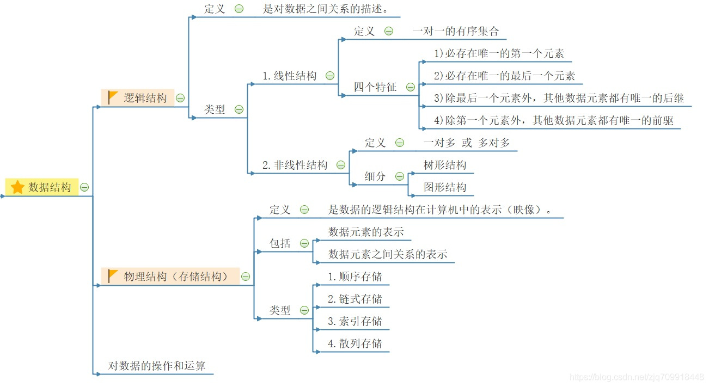
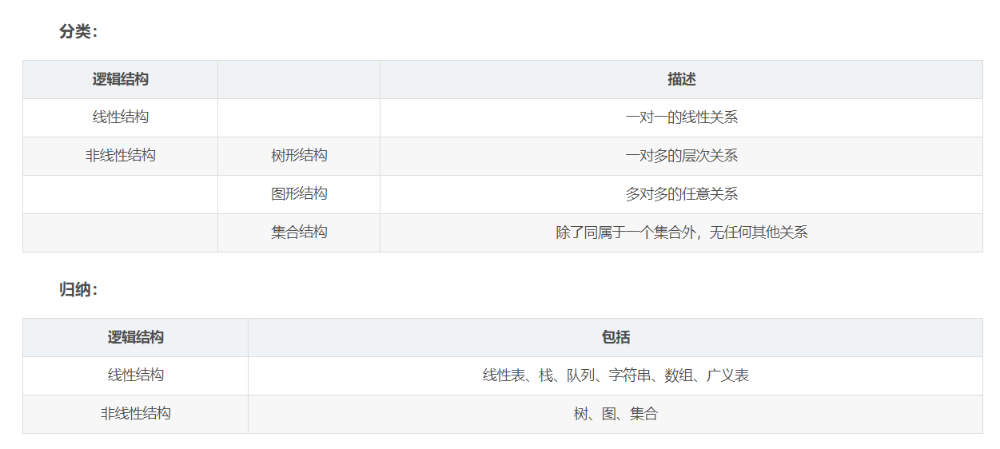
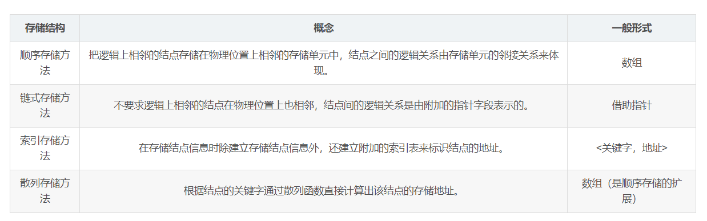
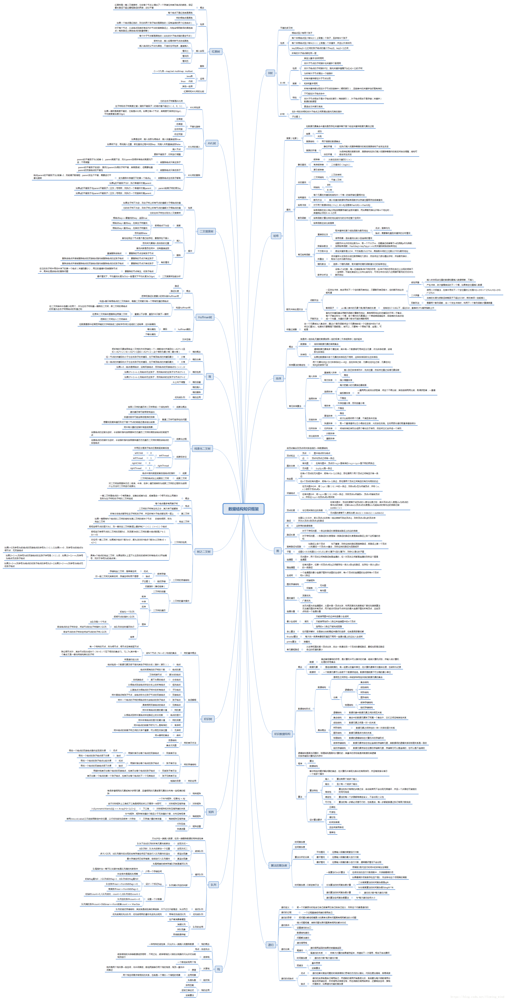
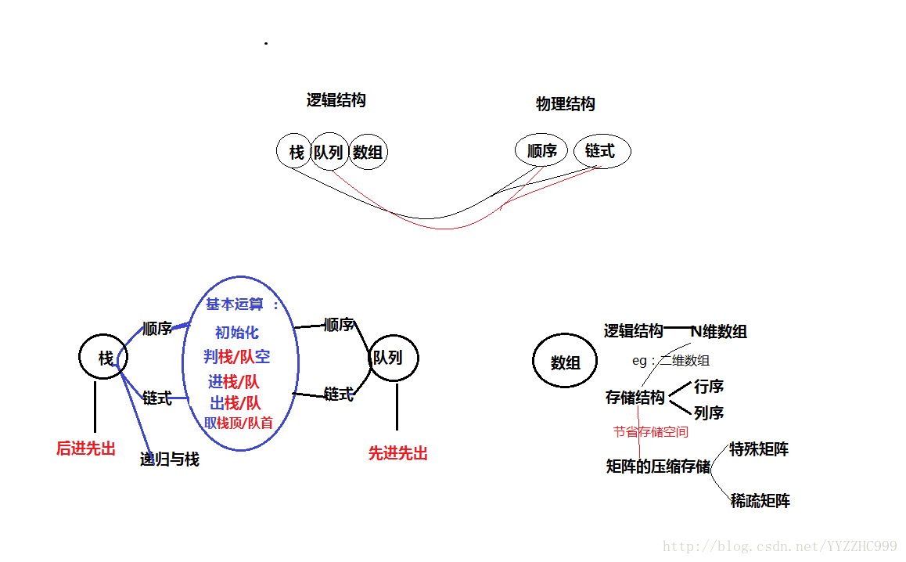
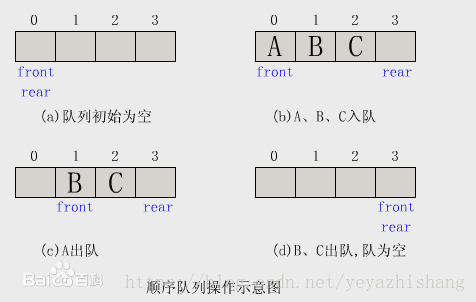
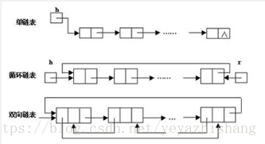
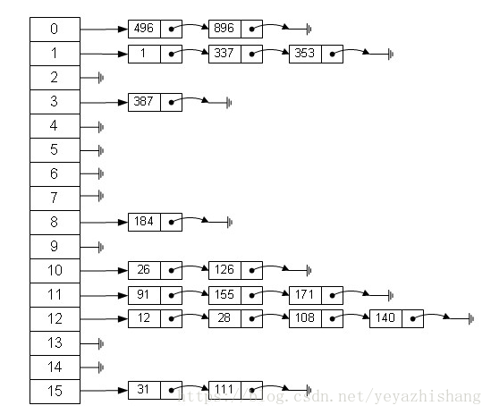
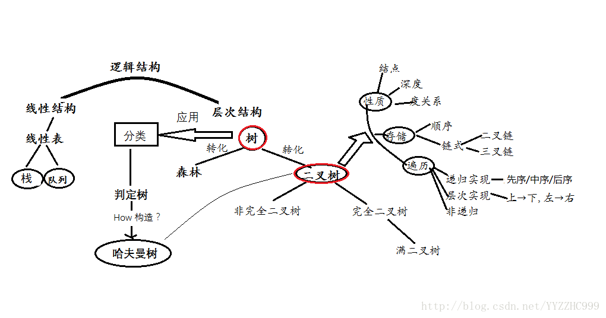
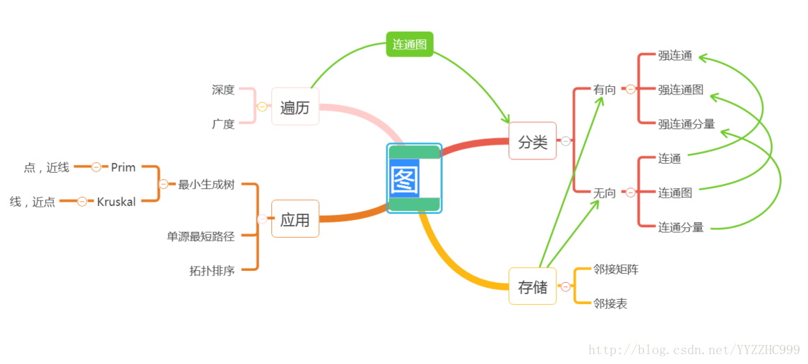

# 数据结构和算法

* [基本概念](#基本概念)
    - [数据](#数据)
    - [结构](#结构)
    - [算法](#算法)
* [数据结构](#数据结构)
* [常用算法](#常用算法)
* [进阶](#进阶)
* [常见问题](#常见问题)
* [参考资料](#参考资料)  

## 基本概念

### 数据

数据：是用来描述一种客观事物的符号（字符串、数字、json、声音、图片...）。

数据元素：有一定意义的最基本的单位，当我们使用计算机来处理数据的时候，数据元素通常被我们用作一个整体来处理，这个整体又称记录。

数据对象：是指性质相同的数据元素的集合。

数据项：是组成数据的最小单位。

### 结构

数据元素相互之间的关系称之为结构。

结构又分两种：

- 逻辑结构：指反映数据元素之间的逻辑关系的数据结构，其中的逻辑关系是指数据元素之间的前后件关系，而与他们在计算机中的存储位置无关。

    - 线性结构：数据结构中的元素存在一对一的相互关系

    - 非线性结构：数据结构中的元素存在一对多或多对多的相互关系

- 存储结构：指数据的逻辑结构在计算机存储空间的存放形式。

    - 顺序存储：数组就是典型的顺序存储结构
    - 链式存储：链表采用的就是链式存储
    - 索引存储：索引存储的优点是检索速度快，但是需要增加附加的索引表，会占用较多的存储空间
    - 散列存储：散列存储使得检索、增加、删除节点的操作都很快，缺点是解决散列冲突会增加时间和空间的开销，常用的解决散列冲突的方法有开链法和线性探测法







### 算法

算法（Algorithm）是指解题方案的准确而完整的描述，是一系列解决问题的清晰指令，算法代表着用系统的方法描述解决问题的策略机制。

#### 特征
一个算法应该具有以下五个重要的特征：

- 有穷性

    算法的有穷性是指算法必须能在执行有限个步骤之后终止。

- 确切性

    算法的每一步骤必须有确切的定义。

- 输入项

    一个算法有0个或多个输入，以刻画运算对象的初始情况，所谓0个输入是指算法本身定出了初始条件

- 输出项

    一个算法有一个或多个输出，以反映对输入数据加工后的结果。没有输出的算法是毫无意义的。

- 可行性

    算法中执行的任何计算步骤都是可以被分解为基本的可执行的操作步骤，即每个计算步骤都可以在有限时间内完成（也称之为有效性）。

#### 算法分析

- 时间复杂度

    算法的时间复杂度是指执行算法所需要的计算工作量。一般来说，计算机算法是问题规模n 的函数f(n)，算法的时间复杂度也因此记做。

    T(n)=Ο(f(n))

    因此，问题的规模n 越大，算法执行的时间的增长率与f(n) 的增长率正相关，称作渐进时间复杂度。

- 空间复杂度

    算法的空间复杂度是指算法需要消耗的内存空间。其计算和表示方法与时间复杂度类似，一般都用复杂度的渐近性来表示。同时间复杂度相比，空间复杂度的分析要简单得多。

- 正确性

    算法的正确性是评价一个算法优劣的最重要的标准。

- 可读性

    算法的可读性是指一个算法可供人们阅读的容易程度。

- 健壮性（亦称鲁棒性)

    健壮性是指一个算法对不合理数据输入的反应能力和处理能力，也称为容错性。

## 数据结构



### 数组
https://www.runoob.com/js/js-obj-array.html

数组是一种聚合数据类型，它是将具有相同类型的若干变量有序地组织在一起的集合。数组可以说是最基本的数据结构，在各种编程语言中都有对应。一个数组可以分解为多个数组元素，按照数据元素的类型，数组可以分为整型数组、字符型数组、浮点型数组、指针数组和结构数组等。数组还可以有一维、二维以及多维等表现形式。

常用数组方法：

- 数组末尾添加新元素 push(), 
- 取数组最后一个元素 pop(), 
- 合并数组 concat(), 
- 用数组的元素组成字符串 join(), 
- 取数组的第一个元素 shift(), 
- 从某个已有的数组返回选定的元素 slice(),
- 在数组开头添加新元素 unshift(),
- 向/从数组中添加/删除元素，然后返回被删除的元素 splice(),
- 排序 sort(),
- 反排序 reverse(),

### 集合

集合是数学中的一个基本概念，表示具有某种特性的对象汇总成的集体。在ES6中也引入了集合类型Set，Set和Array有一定程度的相似，不同的是Set中不允许出现重复的元素而且是无序的。

- values：返回集合中的所有元素
- size：返回集合中元素的个数
- has：判断集合中是否存在某个元素
- add：向集合中添加元素
- remove：从集合中移除某个元素
- union：返回两个集合的并集
- intersection：返回两个集合的交集
- difference：返回两个集合的差集
- subset：判断一个集合是否为另一个集合的子集


### 栈




栈（stack）又名堆栈，它是一种运算受限的线性表。限定仅在表尾进行插入和删除操作的线性表。这一端被称为栈顶，相对地，把另一端称为栈底。向一个栈插入新元素又称作进栈、入栈或压栈，它是把新元素放到栈顶元素的上面，使之成为新的栈顶元素；从一个栈删除元素又称作出栈或退栈，它是把栈顶元素删除掉，使其相邻的元素成为新的栈顶元素。栈中没有数据时，称为空栈。

- push：将一个元素推入栈顶
- pop：移除栈顶元素，并返回被移除的元素
- peek：返回栈顶元素
- length：返回栈中元素的个数

### 队列



队列是一种特殊的线性表，特殊之处在于它只允许在表的前端（front）进行删除操作，而在表的后端（rear）进行插入操作，和栈一样，队列是一种操作受限制的线性表。进行插入操作的端称为队尾，进行删除操作的端称为队头。队列中没有元素时，称为空队列。

- enqueue：入列，向队列尾部增加一个元素
- dequeue：出列，移除队列头部的一个元素并返回被移除的元素
- front：获取队列的第一个元素
- isEmpty：判断队列是否为空
- size：获取队列中元素的个数

### 链表



链表是一种物理存储单元上非连续、非顺序的存储结构，数据元素的逻辑顺序是通过链表中的指针链接次序实现的。链表由一系列结点（链表中每一个元素称为结点）组成，结点可以在运行时动态生成。每个结点包括两个部分：一个是存储数据元素的数据域，另一个是存储下一个结点地址的指针域。 相比于线性表顺序结构，操作复杂。由于不必须按顺序存储，链表在插入的时候可以达到O(1)的复杂度，比另一种线性表顺序表快得多，但是查找一个节点或者访问特定编号的节点则需要O(n)的时间，而线性表和顺序表相应的时间复杂度分别是O(logn)和O(1)。

- size：返回链表中节点的个数
- head：返回链表中的头部元素
- add：向链表尾部增加一个节点
- remove：删除某个节点
- indexOf：返回某个节点的index
- elementAt：返回某个index处的节点
- addAt：在某个index处插入一个节点
- removeAt：删除某个index处的节点

### 散列表/哈希表



Hash Table是一种用于存储键值对（key value pair）的数据结构，因为Hash Table根据key查询value的速度很快，所以它常用于实现Map、Dictinary、Object等数据结构。Hash函数要求相同输入对应的输出必须相等，而不同输入对应的输出必须不等，相当于对每对数据打上唯一的指纹。

- add：增加一组键值对
- remove：删除一组键值对
- lookup：查找一个键对应的值

### 树




树是一种数据结构，它是由n(n>=1)个有限结点组成一个具有层次关系的集合。把它叫做“树”是因为它看起来像一棵倒挂的树，也就是说它是根朝上，而叶朝下的。
它具有以下的特点：

- 每个结点有零个或多个子结点；
- 没有父结点的结点称为根结点；
- 每一个非根结点有且只有一个父结点；
- 除了根结点外，每个子结点可以分为多个不相交的子树。

空集合也是树，称为空树。空树中没有结点；

孩子结点或子结点：一个结点含有的子树的根结点称为该结点的子结点；

结点的度：一个结点含有的子结点的个数称为该结点的度；

叶结点或终端结点：度为0的结点称为叶结点；

非终端结点或分支结点：度不为0的结点；

双亲结点或父结点：若一个结点含有子结点，则这个结点称为其子结点的父结点；

兄弟结点：具有相同父结点的结点互称为兄弟结点；

树的度：一棵树中，最大的结点的度称为树的度；

结点的层次：从根开始定义起，根为第1层，根的子结点为第2层，以此类推；

树的高度或深度：树中结点的最大层次；

堂兄弟结点：双亲在同一层的结点互为堂兄弟；

结点的祖先：从根到该结点所经分支上的所有结点；

子孙：以某结点为根的子树中任一结点都称为该结点的子孙；

森林：由m(m>=0)棵互不相交的树的集合称为森林。

#### 分类

无序树：树中任意节点的子结点之间没有顺序关系，这种树称为无序树,也称为自由树；

有序树：树中任意节点的子结点之间有顺序关系，这种树称为有序树；

二叉树：每个节点最多含有两个子树的树称为二叉树；

满二叉树：叶节点除外的所有节点均含有两个子树的树被称为满二叉树；

完全二叉树：有2^k-1个节点的满二叉树称为完全二叉树；

哈夫曼树（最优二叉树）：带权路径最短的二叉树称为哈夫曼树或最优二叉树。

- add：向树中插入一个节点
- findMin：查找树中最小的节点
- findMax：查找树中最大的节点
- find：查找树中的某个节点
- isPresent：判断某个节点在树中是否存在
- remove：移除树中的某个节点

### 图




图是另一种非线性数据结构。在图结构中，数据结点一般称为顶点，而边是顶点的有序偶对。如果两个顶点之间存在一条边，那么就表示这两个顶点具有相邻关系。
https://baike.baidu.com/item/%E5%9B%BE/13018767
#### 分类

- 有向图

    如果给图的每条边规定一个方向，那么得到的图称为有向图。在有向图中，与一个节点相关联的边有出边和入边之分。

- 无向图

    边没有方向的图称为无向图。

- 单图

    一个图如果任意两顶点之间只有一条边（在有向图中为两顶点之间每个方向只有一条边）；边集中不含环，则称为单图。

#### 术语

- 阶（Order）：图G中点集V的大小称作图G的阶。
- 子图（Sub-Graph）：当图G'=(V',E')其中V‘包含于V，E’包含于E，则G'称作图G=(V,E)的子图。每个图都是本身的子图。
- 生成子图（Spanning Sub-Graph）：指满足条件V(G') = V(G)的G的子图G'。
- 导出子图（Induced Subgraph）：以图G的顶点集V的非空子集V1为顶点集，以两端点均在V1中的全体边为边集的G的子图，称为V1导出的导出子图；以图G的边集E的非空子集E1为边集，以E1中边关联的顶点的全体为顶点集的G的子图，称为E1导出的导出子图。
- 度（Degree）：一个顶点的度是指与该顶点相关联的边的条数，顶点v的度记作d(v)。
- 入度（In-degree）和出度（Out-degree）：对于有向图来说，一个顶点的度可细分为入度和出度。一个顶点的入度是指与其关联的各边之中，以其为终点的边数；出度则是相对的概念，指以该顶点为起点的边数。
- 自环（Loop）：若一条边的两个顶点为同一顶点，则此边称作自环。
- 路径（Path）：从u到v的一条路径是指一个序列v0,e1,v1,e2,v2,...ek,vk，其中ei的顶点为vi及vi - 1，k称作路径的长度。如果它的起止顶点相同，该路径是“闭”的，反之，则称为“开”的。一条路径称为一简单路径(simple path)，如果路径中除起始与终止顶点可以重合外，所有顶点两两不等。
- 行迹（Trace）：如果路径P(u,v)中的边各不相同，则该路径称为u到v的一条行迹。
- 轨道（Track）：如果路径P(u,v)中的顶点各不相同，则该路径称为u到v的一条轨道。
闭的行迹称作回路（Circuit），闭的轨称作圈（Cycle）。
（另一种定义是：walk对应上述的path，path对应上述的track。Trail对应trace。）
- 桥（Bridge）：若去掉一条边，便会使得整个图不连通，该边称为桥。

## 常用算法

### 排序

https://www.cnblogs.com/hmagogo/p/8513365.html

- 冒泡排序

实现冒泡排序的思路：数组中有 n 个数，比较每相邻两个数，如果前者大于后者，就把两个数交换位置；这样一来，第一轮就可以选出一个最大的数放在最后面；那么经过 n-1（数组的 length - 1） 轮，就完成了所有数的排序。
``` javascript
//思路：先比较一轮一次，然后用for循环比较一轮多次，然后再加for循环比较多轮多次
//从大到小排序
var array = [5, 6, 4, 2, 2, 7, 3];
//比较轮数
for (var i = 0; i < array.length - 1; i++) {
    //每轮比较次数，次数=长度-1-此时的轮数
    for (var j = 0; j < array.length - 1 - i; j++) {
        if (array[j] > array[j + 1]) {
            var temp = array[i];
            array[j] = array[j + 1];
            array[j + 1] = temp;
        }
    }
}
```

- 快速排序

快速排序的思想：数组中指定一个元素作为标尺，比它大的放到该元素后面，比它小的放到该元素前面，如此重复直至全部正序排列。

快速排序分三步：
- 选基准：在数据结构中选择一个元素作为基准(pivot)。
- 划分区：参照基准元素值的大小，划分无序区，所有小于基准元素的数据放入一个区间，所有大于基准元素的数据放入另一区间，分区操作结束后，基准元素所处的位置就是最终排序后它应该所处的位置。
- 递归：对初次划分出来的两个无序区间，递归调用第 1步和第 2步的算法，直到所有无序区间都只剩下一个元素为止。

``` javascript
function quickSort(arr) {
    if (arr.length <= 1) return;

    //取数组最接近中间的数位基准，奇数与偶数取值不同，但不印象，当然，你可以选取第一个，或者最后一个数为基准，这里不作过多描述
    var pivotIndex = Math.floor(arr.length / 2);
    var pivot = arr.splice(pivotIndex, 1)[0];
    //左右区间，用于存放排序后的数
    var left = [];
    var right = [];

    for (var i = 0; i < arr.length; i++) {
        //小于基准，放于左区间，大于基准，放于右区间
        if (arr[i] < pivot) {
            left.push(arr[i]);
        } else {
            right.push(arr[i]);
        }
    }
    //这里使用concat操作符，将左区间，基准，右区间拼接为一个新数组
    //然后递归1，2步骤，直至所有无序区间都 只剩下一个元素 ，递归结束
    return quickSort(left).concat([pivot], quickSort(right));
}
```

- 选择排序

选择排序是一个简单直观的排序方法，它的工作原理很简单，首先从未排序序列中找到最大的元素，放到已排序序列的末尾，重复上述步骤，直到所有元素排序完毕。

``` javascript
function selsetSort(arr) {
    var len = arr.length;
    var index;
    for (var i = 0; i < len - 1; i++) {
        index = i;
        for (var j = i + 1; j < len; j++) {
            if (arr[index] > arr[j]) {//寻找最小值
                index = j;//保存最小值的索引
            }
        }
        if (index != i) {
            var temp = arr[i];
            arr[i] = arr[index];
            arr[index] = temp;
        }
    }
    return arr;
}
```

### 查找

- 线性查找
``` javascript
//线性搜索
//A为数组，x为要搜索的值
function linearSearch(A, x) {
    for (var i = 0; i < A.length; i++) {
        if (A[i] == x) {
            return i;
        }
    }
    return -1;
}
```
- 二分查找
https://www.cnblogs.com/aizz/p/9348591.html

- 插值查找
https://blog.csdn.net/qq_40731976/article/details/113173237

### 数学

- 位运算
https://github.com/trekhleb/javascript-algorithms/blob/master/src/algorithms/math/bits/README.zh-CN.md

- 阶乘
``` javascript
function factorialize(num) {
    var result = 1;
    for (var i = 1; i <= num; i++) {
        result *= i;
    }
    return result;
}
```

- 最小公倍数，最大公约数
https://www.cnblogs.com/zhao12354/p/5721542.html

- 杨辉三角
https://www.cnblogs.com/lhh520/p/10260489.html

### 集合

- 洗牌算法
https://www.cnblogs.com/mengfangui/p/8631351.html

- 最长公共子序列（LCS）
https://blog.csdn.net/hj7jay/article/details/79350978

- 最大子序列和
https://blog.csdn.net/qq_40511157/article/details/103181495

- 笛卡尔积
https://blog.csdn.net/zhangchao19890805/article/details/51706513

## 进阶

### 算法范式
算法范式是一种通用方法，基于一类算法的设计。这是比算法更高的抽象，就像算法是比计算机程序更高的抽象。

- BF算法

    查找/搜索所有可能性并选择最佳解决方案

- 贪心算法

    在当前选择最佳选项，不考虑以后情况 

- 分治算法

    将问题分成较小的部分，然后解决这些部分 

- 动态编程

    使用以前找到的子解决方案构建解决方案

- 回溯算法

    类似于 BF 算法，试图产生所有可能的解决方案，但每次生成解决方案测试如果它满足所有条件，那么只有继续生成后续解决方案。否则回溯并继续寻找不同路径的解决方案。 

## 常见问题

- https://leetcode-cn.com/problemset/algorithms/

- https://blog.csdn.net/snsHL9db69ccu1aIKl9r/article/details/105131825

- https://www.jb51.net/article/101020.htm

- 不借助临时变量，进行两个整数的交换
```javascript
function swap(a, b) {
    b = b - a;
    a = a + b;
    b = a - b;
    return [a, b];
}
```

## 参考资料

https://github.com/trekhleb/javascript-algorithms/blob/master/README.zh-CN.md

https://blog.csdn.net/weixin_44153518/article/details/103608258
