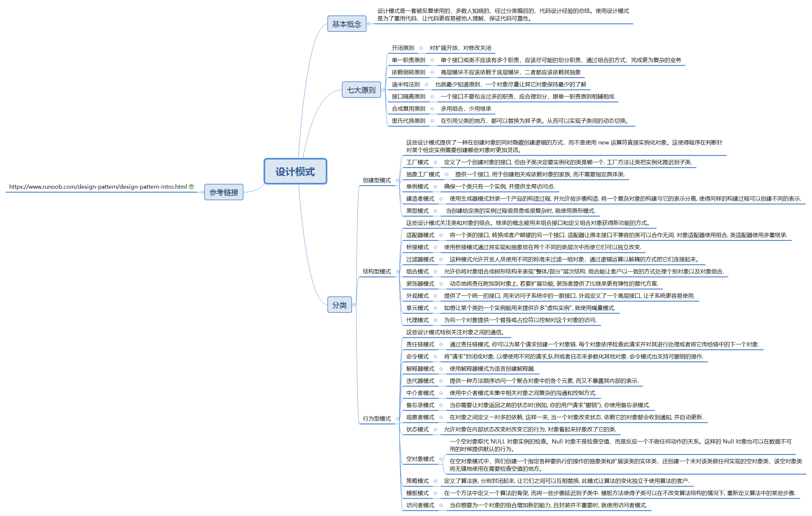

# 设计模式

* [基本概念](#基本概念)
* [七大原则](#七大原则)
* [基本分类](#基本分类)
    - [创建型模式](#创建型模式)
    - [结构型模式](#结构型模式)
    - [行为性模式](#行为性模式)
* [进阶](#进阶)
* [常见问题](#常见问题)
* [参考资料](#参考资料)  
* [图示总结](#图示总结)  

## 基本概念
设计模式是一套被反复使用的、多数人知晓的、经过分类编目的、代码设计经验的总结。使用设计模式是为了重用代码、让代码更容易被他人理解、保证代码可靠性。

## 七大原则

- 开闭原则

    尽量通过扩展软件实体来解决需求变化，而不是通过修改已有的代码来完成变化

- 单一职责原则

    单个接口或类不应该有多个职责，应该尽可能的划分职责，通过组合的方式，完成更为复杂的业务

- 依赖倒置原则

    高层模块不应该依赖于底层模块，二者都应该依赖其抽象

- 迪米特法则

    也就最少知道原则，一个对象尽量让其它对象保持最少的了解

- 接口隔离原则

    一个接口不要包含过多的职责，应合理划分，跟单一职责原则相辅相成

- 合成复用原则

    多用组合，少用继承

- 里氏代换原则

    在引用父类的地方，都可以替换为其子类。从而可以实现子类间的动态切换。

## 基本分类

### 创建型模式

这些设计模式提供了一种在创建对象的同时隐藏创建逻辑的方式，而不是使用 new 运算符直接实例化对象。这使得程序在判断针对某个给定实例需要创建哪些对象时更加灵活。

- 工厂模式

    定义了一个创建对象的接口, 但由子类决定要实例化的类是哪一个. 工厂方法让类把实例化推迟到子类.

- 抽象工厂模式

    提供一个接口, 用于创建相关或依赖对象的家族, 而不需要指定具体类.

- 单例模式

    确保一个类只有一个实例, 并提供全局访问点.

- 建造者模式

    使用生成器模式封装一个产品的构造过程, 并允许按步骤构造. 将一个复杂对象的构建与它的表示分离, 使得同样的构建过程可以创建不同的表示.

- 原型模式

    当创建给定类的实例过程很昂贵或很复杂时, 就使用原形模式.

### 结构型模式

这些设计模式关注类和对象的组合。继承的概念被用来组合接口和定义组合对象获得新功能的方式。

- 适配器模式

    将一个类的接口, 转换成客户期望的另一个接口. 适配器让原本接口不兼容的类可以合作无间. 对象适配器使用组合, 类适配器使用多重继承.

- 桥接模式

    使用桥接模式通过将实现和抽象放在两个不同的类层次中而使它们可以独立改变.

- 过滤器模式

    这种模式允许开发人员使用不同的标准来过滤一组对象，通过逻辑运算以解耦的方式把它们连接起来。

- 组合模式

    允许你将对象组合成树形结构来表现"整体/部分"层次结构. 组合能让客户以一致的方式处理个别对象以及对象组合.

- 装饰器模式

    动态地将责任附加到对象上, 若要扩展功能, 装饰者提供了比继承更有弹性的替代方案.

- 外观模式

     提供了一个统一的接口, 用来访问子系统中的一群接口. 外观定义了一个高层接口, 让子系统更容易使用.

- 享元模式

    如想让某个类的一个实例能用来提供许多"虚拟实例", 就使用蝇量模式.

- 代理模式

    为另一个对象提供一个替身或占位符以控制对这个对象的访问.

### 行为性模式

这些设计模式特别关注对象之间的通信。

- 责任链模式

    通过责任链模式, 你可以为某个请求创建一个对象链. 每个对象依序检查此请求并对其进行处理或者将它传给链中的下一个对象.

- 命令模式

    将"请求"封闭成对象, 以便使用不同的请求,队列或者日志来参数化其他对象. 命令模式也支持可撤销的操作.

- 解释器模式

    使用解释器模式为语言创建解释器.

- 迭代器模式

    提供一种方法顺序访问一个聚合对象中的各个元素, 而又不暴露其内部的表示.

- 中介者模式

    使用中介者模式来集中相关对象之间复杂的沟通和控制方式.

- 备忘录模式

    当你需要让对象返回之前的状态时(例如, 你的用户请求"撤销"), 你使用备忘录模式.

- 观察者模式

    在对象之间定义一对多的依赖, 这样一来, 当一个对象改变状态, 依赖它的对象都会收到通知, 并自动更新.

- 状态模式

    允许对象在内部状态改变时改变它的行为, 对象看起来好象改了它的类.

- 空对象模式

    一个空对象取代 NULL 对象实例的检查。Null 对象不是检查空值，而是反应一个不做任何动作的关系。这样的 Null 对象也可以在数据不可用的时候提供默认的行为。

    在空对象模式中，我们创建一个指定各种要执行的操作的抽象类和扩展该类的实体类，还创建一个未对该类做任何实现的空对象类，该空对象类将无缝地使用在需要检查空值的地方。

- 策略模式

    定义了算法族, 分别封闭起来, 让它们之间可以互相替换, 此模式让算法的变化独立于使用算法的客户.

- 模板模式

    在一个方法中定义一个算法的骨架, 而将一些步骤延迟到子类中. 模板方法使得子类可以在不改变算法结构的情况下, 重新定义算法中的某些步骤.

- 访问者模式

    当你想要为一个对象的组合增加新的能力, 且封装并不重要时, 就使用访问者模式.

## 进阶

- 单例模式

    单例模式是一种常用的软件设计模式，在应用这个模式时，单例对象的类必须保证只有一个实例存在，整个系统只能使用一个对象实例。

    优点：不会频繁地创建和销毁对象，浪费系统资源。

    代码：
    ``` typescript
    export class Singleton {
        private static _instance: Singleton;
        public static get Instance(): Singleton {
            if (!this._instance) {
                this._instance = new Singleton();
            }
            return this._instance;
        }

        public test = (): string => {
            return 'Singleton';
        }
    }
    ```
    调用：
    ``` typescript
    import singleton from './Singleton';
    export class Test {
        doTest = () => {
            const str = singleton.test();
            console.log(str);
        }
    }
    ```

- 工厂模式

    https://www.runoob.com/design-pattern/factory-pattern.html

- 建造者模式

    https://www.jianshu.com/p/3d1c9ffb0a28

- 代理模式

    https://www.cnblogs.com/daniels/p/8242592.html

- 装饰器模式

    https://www.cnblogs.com/volcano-liu/p/10897897.html

- 观察者模式

    https://www.cnblogs.com/adamjwh/p/10913660.html

## 常见问题

- 简述重载和重写

    https://www.cnblogs.com/upcwanghaibo/p/6527354.html

- MVC模式、MVVC模式

    https://www.runoob.com/design-pattern/mvc-pattern.html
    https://blog.csdn.net/liitdar/article/details/86685880
    https://www.cnblogs.com/junhuawang/p/5211892.html

- 工厂模式和抽象工厂模式的区别

    https://www.cnblogs.com/yssjun/p/11102162.html

- 请举例说明什么情况下会更倾向于使用抽象类而不是接口？

    接口和抽象类都遵循”面向接口而不是实现编码”设计原则，它可以增加代码的灵活性，可以适应不断变化的需求。

    在 Java 中，你只能继承一个类，但可以实现多个接口。所以一旦你继承了一个类，你就失去了继承其他类的机会了。

    接口通常被用来表示附属描述或行为如：Runnable、Clonable、Serializable等等，因此当你使用抽象类来表示行为时，你的类就不能同时是Runnable和Clonable(注：这里的意思是指如果把Runnable等实现为抽象类的情况)，因为在 Java 中你不能继承两个类，但当你使用接口时，你的类就可以同时拥有多个不同的行为。

    在一些对时间要求比较高的应用中，倾向于使用抽象类，它会比接口稍快一点。
    
    如果希望把一系列行为都规范在类继承层次内，并且可以更好地在同一个地方进行编码，那么抽象类是一个更好的选择。有时，接口和抽象类可以一起使用，接口中定义函数，而在抽象类中定义默认的实现。

## 参考资料

https://www.runoob.com/design-pattern/design-pattern-intro.html

https://www.cnblogs.com/dailyprogrammer/articles/12272717.html

## 图示总结
