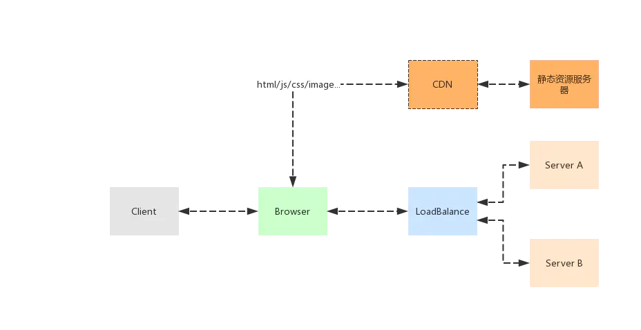
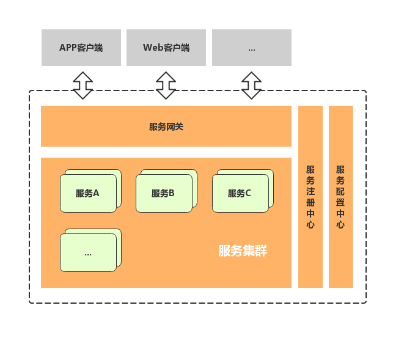
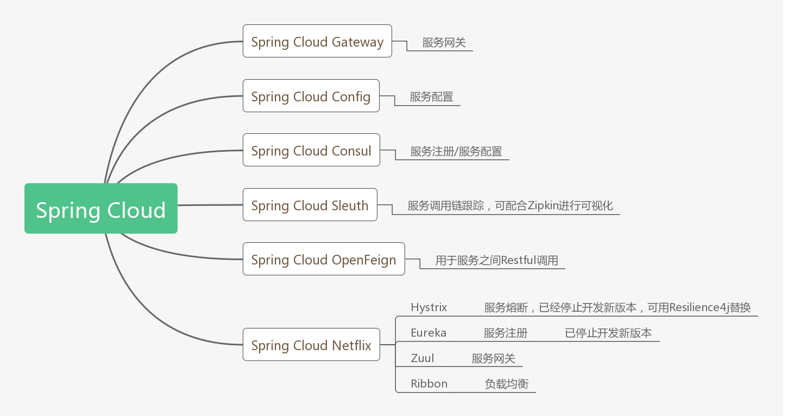

# 微服务
* [基本概念](#基本概念)
    - [什么是微服务](#什么是微服务)
    - [为什么用微服务](#为什么用微服务)
    - [微服务典型架构](#微服务典型架构)

* [进阶](#进阶)
    - [进阶-1](#进阶-1)
    - [进阶-2](#进阶-2)
* [常见问题](#常见问题)
* [参考资料](#参考资料)  

## 基本概念

### 什么是微服务
微服务 (Microservices) 就是一些协同工作小而自治的服务。

2014年，Martin Fowler 与 James Lewis 共同提出了微服务的概念，定义了微服务是由以单一应用程序构成的小服务，自己拥有自己的行程与轻量化处理，服务依业务功能设计，以全自动的方式部署，与其他服务使用 HTTP API 通信。同时服务会使用最小的规模的集中管理 (例如Docker) 能力，服务可以用不同的编程语言与数据库等组件实现。

#### 微服务与SOA
面向服务的体系结构 SOA (Service-Oriented Architecture) 听起来和微服务很像，但 SOA早期均使用了总线模式，这种总线模式是与某种技术栈强绑定的，比如：J2EE。这导致很多企业的遗留系统很难对接，切换时间太长，成本太高，新系统稳定性的收敛也需要一些时间，最终SOA 看起来很美，但却成为了企业级奢侈品，中小公司都望而生畏。
维基上对其定义为：一种软件开发技术- 面向服务的体系结构（SOA）架构样式的一种变体，将应用程序构造为一组松散耦合的服务。在微服务体系结构中，服务是细粒度的，协议是轻量级的。

微服务的特点：
* 单一职责的。一个微服务应该都是单一职责的，这才是“微”的体现，一个微服务解决一个业务问题（注意是一个业务问题而不是一个接口）。
* 面向服务的。将自己的业务能力封装并对外提供服务，这是继承SOA的核心思想，一个微服务本身也可能使用到其它微服务的能力。

### 为什么用微服务
要理解什么是微服务，那么可以先理解什么是单体应用（Monolithic application），在没有提出微服务的概念的“远古”年代，一个软件应用，往往会将应用所有功能都开发和打包在一起，那时候的一个B/S应用架构往往是这样的：

#### 单体应用程序的优点
* 开发简洁，功能都在单个程序内部，便于软件设计和开发规划。
* 容易部署，程序单一不存在分布式集群的复杂部署环境，降低了部署难度。
* 容易测试，没有各种复杂的服务调用关系，都是内部调用方便测试。

#### 单体应用的缺陷
* 代码臃肿，应用启动时间长
* 回归测试周期长，修复一个小小bug可能都需要对所有关键业务进行回归测试。
* 应用容错性差，某个小小功能的程序错误可能导致整个系统宕机；
* 伸缩困难，单体应用扩展性能时只能整个应用进行扩展，造成计算资源浪费。
* 开发协作困难，一个大型应用系统，可能几十个甚至上百个开发人员，大家都在维护一套代码的话，代码merge复杂度急剧增加。

任何新技术的出现都是为了解决原有技术无法解决的需求，所以，微服务的出现就是因为原来单体应用架构已经无法满足当前互联网产品的技术需求。

#### 微服务的优点
* 技术异构性
* 隔离性
* 可扩展性
* 简化部署
* 易优化

#### 微服务的缺点
微服务解决了单体应用的欠缺点，但同时自身也带来了一些缺点，比如拆分后导致服务管理起来麻烦。 
* 微服务架构整个应用分散成多个服务，定位故障点非常困难。
* 稳定性下降。服务数量变多导致其中一个服务出现故障的概率增大，并且一个服务故障可能导致整个系统挂掉。事实上，在大访问量的生产场景下，故障总是会出现的。
* 服务数量非常多，部署、管理的工作量很大。
* 开发方面：如何保证各个服务在持续开发的情况下仍然保持协同合作。
* 测试方面：服务拆分后，几乎所有功能都会涉及多个服务。原本单个程序的测试变为服务间调用的测试。测试变得更加复杂。

为了解决微服务的缺点，有一些最佳实践来解决，比如解决服务注册与发现、服务容错、服务安全、服务治理等。

### 微服务典型架构

微服务架构，核心是为了解决应用微服务化之后的服务治理问题。

应用微服务化之后，首先遇到的第一个问题就是服务发现问题，一个微服务如何发现其他微服务呢？最简单的方式就是每个微服务里面配置其他微服务的地址，但是当微服务数量众多的时候，这样做明显不现实。所以需要使用到微服务架构中的一个最重要的组件：服务注册中心，所有服务都注册到服务注册中心，同时也可以从服务注册中心获取当前可用的服务清单。

接着需要解决微服务分布式部署带来的第二个问题：服务配置管理的问题。当服务数量超过一定程度之后，如果需要在每个服务里面分别维护每一个服务的配置文件，运维人员估计要哭了。那么，就需要用到微服务架构里面第二个重要的组件：配置中心，微服务架构就变成下面这样了

### 主流微服务框架
目前国内企业使用的微服务框架主要是Spring Cloud和Dubbo（或者DubboX），但是Dubbo那两年的停更严重打击了开发人员对它的信心，Spring Cloud已经逐渐成为主流，比较两个框架的优劣势的文章在网上有很多，这里就不重复了，选择什么框架还是按业务需求来吧，业务框架决定技术框架。
Spring Cloud全家桶提供了各种各样的组件，基本可以覆盖微服务的服务治理的方方面面，以下列出了Spring Cloud一些常用组件：

#### 下一代微服务
目前网上很多说是下一代微服务架构就是Service Mesh，Service Mesh主流框架有Linkerd和Istio，其中Istio有大厂加持所以呼声更高。Service Mesh我接触还不多，但是个人感觉并不一定能称为下一代微服务架构，可能认为是服务治理的另外一种解决方案更合适，是否能够取代当前的微服务架构还需要持续观察。

https://zhuanlan.zhihu.com/p/61901608

### 微服务的划分
https://zhuanlan.zhihu.com/p/86346030

## 进阶

### 微服务相关实践
https://www.cnblogs.com/skabyy/p/11396571.html

#### 服务发现
https://www.jianshu.com/p/1bf9a46efe7a

#### 配置中心
https://www.jianshu.com/p/0f84f2c66cf5

#### 链路追踪
https://www.cnblogs.com/pingyeaa/p/10987438.html

https://blog.csdn.net/pengjunlee/article/details/87797969

### 关键支持技术和工具
#### 容器，Docker和Kubernetes
微服务的关键要素之一是它通常很小。（没有任意数量的代码来确定某项内容是否为微服务，但名称中恰好有“微”字。）

当码头工人在现代化的集装箱时代迎来了2013年，它也推出了计算模型，将成为微服务最密切相关。由于单个容器没有自己操作系统的开销，因此它们比传统虚拟机更小，更轻，并且可以更快地上下旋转，从而使其与微服务架构中的更小，更轻便的服务完美匹配。 。

随着服务和容器的激增，对大型容器进行编排和管理很快成为关键挑战之一。Kubernetes已经成为世界上最受欢迎的容器编排 技术之一，因为它做得很好。

#### API网关
微服务通常通过API进行通信，尤其是在首次建立状态时。虽然确实可以实现客户端和服务之间的直接通信，但API网关通常是有用的中介层，尤其是随着应用程序中服务数量的不断增长。API网关通过路由请求，将请求散布到多个服务中并提供额外的安全性和身份验证，充当客户端的反向代理。

有迹象表明，可用于执行API网关，包括API管理平台的多种技术，但如果正在使用集装箱和Kubernetes实现的微服务架构中，网关使用的入口或更近，通常实现Istio。

#### 讯息传递
尽管最佳实践可能是设计无状态服务，但是状态仍然存在，服务需要意识到这一点。尽管API调用通常是初始为给定服务建立状态的有效方法，但它并不是保持最新状态的特别有效方法。不断的民意测验“我们到了吗？” 使服务保持最新状态的方法根本不切实际。

相反，必须将建立状态的API调用与消息传递或事件流耦合在一起，以便服务可以广播状态更改，而其他相关方可以侦听这些更改并相应地进行调整。这项工作可能最适合于通用消息代理，但是在某些情况下，事件流传输平台（例如Apache Kafka）可能是一个很好的选择。
#### 无服务器
无服务器架构将某些核心云和微服务模式纳入其逻辑结论。在无服务器的情况下，执行单元不仅是一个小型服务，而且是一个功能，通常只能是几行代码。无服务器功能与微服务之间的界线模糊，但通常认为功能甚至比微服务小。

无服务器架构和功能即服务（FaaS）平台与微服务共享相似性的地方在于，它们都对创建更小的部署单位以及根据需求进行精确扩展感兴趣。

## 常见问题
https://www.jianshu.com/p/17146fe54fde

## 参考资料
* https://aws.amazon.com/cn/microservices
* https://baike.baidu.com/item/%E5%BE%AE%E6%9C%8D%E5%8A%A1/18758759
* https://www.jianshu.com/p/7293b148028f
* https://www.zhihu.com/question/65502802
