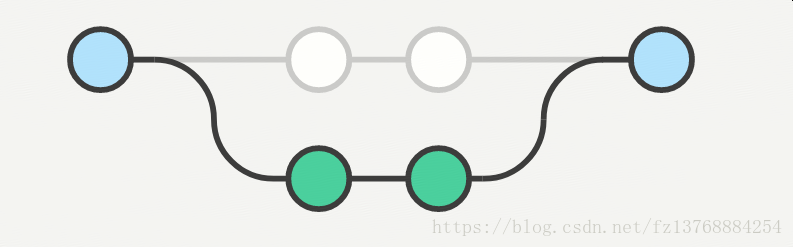

# Git
* [安装配置](#安装配置)
* [基本概念](#基本概念)
* [基础用法](#基础用法)
    - [初始化项目](#初始化项目)
    - [分支标签](#分支标签)
    - [本地修改](#本地修改)
    - [远程操作](#远程操作)
    - [合并](#合并)
    - [回退](#回退)
    - [记录](#记录)
* [常见问题](#常见问题)
* [参考资料](#参考资料)  
* [图示总结](#图示总结)  

## 安装配置

下载地址：https://git-scm.com/downloads

配置说明：https://www.runoob.com/git/git-install-setup.html

## 基本概念

https://www.runoob.com/git/git-workspace-index-repo.html

## 基础用法

### 初始化项目
初始化新项目：git init
克隆项目： git clone

### 分支标签
- 分支
- - 创建分支

    创建新分支：git branch < name >

    创建新分支并切换到创建的分支：git checkout -b < name > / git switch -c < name >  v2.27.0以上支持

- - 查看分支

    查看所有分支：git branch -av

    查看本地分支：git branch

    查看远程分支：git branch -r

    查看已合并分支（基于当前分支）：git branch --merged

    查看未合并分支（基于当前分支）：git branch --no-merged

- - 切换分支

    git checkout < branch >

    git switch < branch >  v2.27.0以上支持

- - 删除分支

    删除本地分支：普通删除 git branch -d < branch > / 强制删除 git branch -D < branch >

- 标签
- - 创建标签

    为最新的commit创建标签：git tag

    为指定commit创建标签：git tag < tagname > < commitId >

    为指定commit创建标签并配上详细说明：git tag -a < tagname > -m "< message >" < commitId >

- - 查看标签

    git show < tagname >

- - 删除标签

    删除本地标签：git tag -d

    删除远程标签：git tag -d&& git push origin :refs/tags/< tagname >

- - 推送标签

    推送单个标签：git push origin < tagname >

    推送全部未上传标签：git push origin --tags

### 本地修改
- 查看修改文件

    git status

- 查看变更内容

    git diff

- 添加变更内容

    添加所有变更内容：git add

    添加指定文件变更：git add -p < file >

- 删除文件

    git rm

- 本地修改提交

    添加并提交：git commit -a

    提交并添加描述信息：git commit -m "< message >"

    修改最后一次提交：git commit --amend （修改最后一次提交（可以通过此命令将修改合并至最后一次提交），不要对已发布过的提交试用此命令）

- 合并本地提交

    git rebase -i HEAD-x

- 暂存

    暂存未commit提交的变更：git stash

    查看所有的暂存内容：git stash list

    取出暂存内容：git stash -pop

### 远程操作

- 查看当前远程配置

    git remote -v

- 创建远程配置

    git remote add < name > < url >

- 拉取远程数据

    git fetch < remote >

    拉取分支远程数据并合并： git pull < remote > < branch >

- 本地数据推至远程

    git push < remote > < branch >

### 合并

- 合并commit

    git cherry-pick < commitId >

- 合并分支

    git merge < branch > （merge时保留分支信息：git merge --no-ff）

    git rebase < branch > （退出rebase：git rebase --abort，继续rebase：git rebase --continue）

- 解决冲突

    手动解决：编辑器解决 / git add < resolved-file > / git rm < resolved-file >

    自动解决：git mergetool

### 回退

- 放弃当前修改回到最近的commit

    git reset --hard HEAD

- 放弃本地某个文件的修改

    git checkout HEAD < file >

    git checkout -- < file >

- 回退已经提交的commit

    git revert < commitId >

- 回退到指定commit

    放弃所有修改：git reset --hard < commitId >

    将当前修改变为未add状态：git reset < commit >

    将未提交修改变为未add状态：git reset --keep < commit >

- 回退至上X版本

    回退至上一版本：git reset --hard HEAD^

    回退至上二版本：git reset --hard HEAD^^

    回退至上100版本：git reset --hard HEAD^100

### 记录

- 展示所有的comm提交

    git log

- 展示某个文件的记录

    git blame < file >

- 展示用户的git操作记录

    git reflog

## 常见问题

- 提交时发生冲突，你能解释冲突是如何产生的吗？你是如何解决的？

    开发过程中，我们都有自己的特性分支，所以冲突发生的并不多，但也碰到过。诸如公共类的公共方法，我和别人同时修改同一个文件，他提交后我再提交就会报冲突的错误。

    发生冲突，在IDE里面一般都是对比本地文件和远程分支的文件，然后把远程分支上文件的内容手工修改到本地文件，然后再提交冲突的文件使其保证与远程分支的文件一致，这样才会消除冲突，然后再提交自己修改的部分。特别要注意下，修改本地冲突文件使其与远程仓库的文件保持一致后，需要提交后才能消除冲突，否则无法继续提交。必要时可与同事交流，消除冲突。

    发生冲突，也可以使用命令。
    - 通过git stash命令，把工作区的修改提交到栈区，目的是保存工作区的修改；
    - 通过git pull命令，拉取远程分支上的代码并合并到本地分支，目的是消除冲突；
    - 通过git stash pop命令，把保存在栈区的修改部分合并到最新的工作空间中；

- 如果本次提交误操作，如何撤销？

    如果想撤销提交到索引区的文件，可以通过git reset HEAD file；如果想撤销提交到本地仓库的文件，可以通过git reset –soft HEAD^n恢复当前分支的版本库至上一次提交的状态，索引区和工作空间不变更；可以通过git reset –mixed HEAD^n恢复当前分支的版本库和索引区至上一次提交的状态，工作区不变更；可以通过git reset –hard HEAD^n恢复当前分支的版本库、索引区和工作空间至上一次提交的状态。

- 能不能说一下git fetch和git pull命令之间的区别？

    简单来说：git fetch branch是把名为branch的远程分支拉取到本地；而git pull branch是在fetch的基础上，把branch分支与当前分支进行merge；因此pull = fetch + merge。

- 能说一下git系统中HEAD、工作树和索引之间的区别吗？

    HEAD文件包含当前分支的引用（指针）；

    工作树是把当前分支检出到工作空间后形成的目录树，一般的开发工作都会基于工作树进行；

    索引index文件是对工作树进行代码修改后，通过add命令更新索引文件；GIT系统通过索引index文件生成tree对象；

- git merge 和 git rebase 的区别？

    原始分支：
    
    将master合并到feature

    1. 使用merge合并后：
    

    - 特点：自动创建一个新的commit, 如果合并的时候遇到冲突，仅需要修改后重新commit
    
    - 优点：将commit的实际情况进行记录，便于以后查看
    
    - 缺点：由于每次merge会自动产生一个merge commit，所以在使用一些git 的GUI tools，如果commit频繁，这样会使得feature分支很杂乱，这时可以考虑使用rebase来进行合并处理。   

    2. 使用rebase合并后：
    

    - 特点：会合并之前的commit历史

    - 优点：得到更简洁的项目历史，去掉了merge commit

    - 缺点：如果合并出现代码问题不容易定位，因为re-write了history

## 参考资料
- https://www.runoob.com/git/git-tutorial.html

- https://www.liaoxuefeng.com/wiki/896043488029600/

## 图示总结
