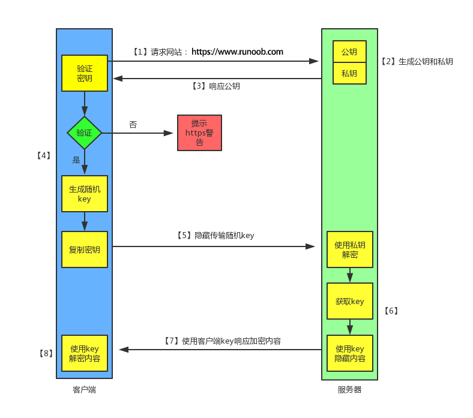

# HTTP/HTTPS
* [基本概念](#基本概念)
    - [HTTP](#HTTP)
    - [HTTPS](#HTTPS)
    - [HTTP 与 HTTPS 区别](#HTTP-与-HTTPS-区别)
    - [TCP三次握手](#TCP三次握手)
    - [TCP四次挥手](#TCP四次挥手)
    - [HTTPS的工作原理](#HTTPS的工作原理)
* [进阶](#进阶)
    - [OSI（Open System Interconnect）开放式系统互联模型](#OSI)
    - [HTTP/2.0](#HTTP/2.0)
    - [http报文详解](#HTTP-报文详解)
* [常见问题](#常见问题)
* [参考资料](#参考资料)  

## 基本概念

### HTTP
HTTP（HyperText Transfer Protocol：超文本传输协议）是一种用于分布式、协作式和超媒体信息系统的应用层协议。 简单来说就是一种发布和接收 HTML 页面的方法，被用于在 Web 浏览器和网站服务器之间传递信息。

HTTP 默认工作在 TCP 协议 80 端口，用户访问网站 http:// 打头的都是标准 HTTP 服务。

HTTP 协议以明文方式发送内容，不提供任何方式的数据加密，如果攻击者截取了Web浏览器和网站服务器之间的传输报文，就可以直接读懂其中的信息，因此，HTTP协议不适合传输一些敏感信息，比如：信用卡号、密码等支付信息。

### HTTPS
HTTPS（Hypertext Transfer Protocol Secure：超文本传输安全协议）是一种透过计算机网络进行安全通信的传输协议。HTTPS 经由 HTTP 进行通信，但利用 SSL/TLS 来加密数据包。HTTPS 开发的主要目的，是提供对网站服务器的身份认证，保护交换数据的隐私与完整性。

HTTPS 默认工作在 TCP 协议443端口，它的工作流程一般如以下方式：

1. TCP 三次同步握手
2. 客户端验证服务器数字证书
3. DH 算法协商对称加密算法的密钥、hash 算法的密钥
4. SSL 安全加密隧道协商完成
5. 网页以加密的方式传输，用协商的对称加密算法和密钥加密，保证数据机密性；用协商的hash算法进行数据完整性保护，保证数据不被篡改。

### HTTP 与 HTTPS 区别
* HTTP 明文传输，数据都是未加密的，安全性较差，HTTPS（SSL+HTTP） 数据传输过程是加密的，安全性较好。
* 使用 HTTPS 协议需要到 CA（Certificate Authority，数字证书认证机构） 申请证书，一般免费证书较少，因而需要一定费用。证书颁发机构如：Symantec、Comodo、GoDaddy 和 GlobalSign 等。
* HTTP 页面响应速度比 HTTPS 快，主要是因为 HTTP 使用 TCP 三次握手建立连接，客户端和服务器需要交换 3 个包，而 HTTPS除了 TCP 的三个包，还要加上 ssl 握手需要的 9 个包，所以一共是 12 个包。
* http 和 https 使用的是完全不同的连接方式，用的端口也不一样，前者是 80，后者是 443。
* HTTPS 其实就是建构在 SSL/TLS 之上的 HTTP 协议，所以，要比较 HTTPS 比 HTTP 要更耗费服务器资源。

### TCP三次握手
在TCP/IP协议中，TCP协议通过三次握手建立一个可靠的连接

* 第一次握手：客户端尝试连接服务器，向服务器发送 syn 包（同步序列编号Synchronize Sequence Numbers），syn=j，客户端进入 SYN_SEND 状态等待服务器确认
* 第二次握手：服务器接收客户端syn包并确认（ack=j+1），同时向客户端发送一个 SYN包（syn=k），即 SYN+ACK 包，此时服务器进入 SYN_RECV 状态
* 第三次握手：第三次握手：客户端收到服务器的SYN+ACK包，向服务器发送确认包ACK(ack=k+1），此包发送完毕，客户端和服务器进入ESTABLISHED状态，完成三次握手

为什么是三次握手?不是两次或者四次？
从假设的角度来分析吧，假如是两次握手，会发生什么情况呢? 服务端在发出应答消息后，它根本就不能确认客户端是否接受到消息了，那么这样意味着只有客户端可以向服务端发送数据。
假如是四次握手呢？明明已经保证了一个稳定的传输流了，为什么还要浪费性能再去发一次消息，浪费了性能。

### TCP四次挥手

* 第一次挥手（[FIN], Seq = x）

    客户端发送一个FIN标记的包，告诉服务器需要关闭连接，表示自己不用发送数据了，但是还可以接收数据。发送完成后，客户端进入FIN_WAIT_1状态。

* 第二次挥手 ([ACK], ACK = x + 1)

    服务端发送一个ACK的确认包，告诉客户端接收到关闭的请求，但是还没有准备好。发送完成后，服务端进入CLOSE_WAIT状态，客户端收到这个包后，进入FIN_WAIT_2，等待服务器关闭连接。

* 第三次挥手 ([FIN], Seq = y)

    服务端准备好关闭连接时，发送FIN标记的包，告诉客户端准备关闭了。发送完成后，服务端进入LAST_ACK状态，等待客户端确认。

* 第四次挥手 ([ACK], ACK = y + 1)

    客户端接收到服务端的关闭请求，再发送ACK标记的确认包，进入TIME_WAIT状态，等待服务端可能请求重传的ACK包。
服务端接收到ACK包后，关闭连接，进入CLOSED状态。
客户端在等待固定时间(两个最大段生命周期)后，没有接收到服务的ACK包，认为服务器已关闭连接，自己也关闭连接，进入CLOSED状态。

为什么是三次握手，却是四次挥手？三次挥手不可以吗？
继续从假设的角度分析，如果是三次挥手，在服务器接收到客户端发送关闭的请求后，把SYN和ACK包一起发过去。这样会造成服务端还有数据没有发送完，造成了数据的丢失。所以中间的这一段时间，等待服务器把剩余的数据发送完是很有必要的。

### HTTPS的工作原理
我们都知道 HTTPS 能够加密信息，以免敏感信息被第三方获取，所以很多银行网站或电子邮箱等等安全级别较高的服务都会采用 HTTPS 协议。

1、客户端发起 HTTPS 请求

这个没什么好说的，就是用户在浏览器里输入一个 https 网址，然后连接到 server 的 443 端口。

2、服务端的配置

采用 HTTPS 协议的服务器必须要有一套数字证书，可以自己制作，也可以向组织申请，区别就是自己颁发的证书需要客户端验证通过，才可以继续访问，而使用受信任的公司申请的证书则不会弹出提示页面(startssl 就是个不错的选择，有 1 年的免费服务)。

这套证书其实就是一对公钥和私钥，如果对公钥和私钥不太理解，可以想象成一把钥匙和一个锁头，只是全世界只有你一个人有这把钥匙，你可以把锁头给别人，别人可以用这个锁把重要的东西锁起来，然后发给你，因为只有你一个人有这把钥匙，所以只有你才能看到被这把锁锁起来的东西。

3、传送证书

这个证书其实就是公钥，只是包含了很多信息，如证书的颁发机构，过期时间等等。

4、客户端解析证书

这部分工作是有客户端的TLS来完成的，首先会验证公钥是否有效，比如颁发机构，过期时间等等，如果发现异常，则会弹出一个警告框，提示证书存在问题。

如果证书没有问题，那么就生成一个随机值，然后用证书对该随机值进行加密，就好像上面说的，把随机值用锁头锁起来，这样除非有钥匙，不然看不到被锁住的内容。

5、传送加密信息

这部分传送的是用证书加密后的随机值，目的就是让服务端得到这个随机值，以后客户端和服务端的通信就可以通过这个随机值来进行加密解密了。

6、服务端解密信息

服务端用私钥解密后，得到了客户端传过来的随机值(私钥)，然后把内容通过该值进行对称加密，所谓对称加密就是，将信息和私钥通过某种算法混合在一起，这样除非知道私钥，不然无法获取内容，而正好客户端和服务端都知道这个私钥，所以只要加密算法够彪悍，私钥够复杂，数据就够安全。

7、传输加密后的信息

这部分信息是服务段用私钥加密后的信息，可以在客户端被还原。

8、客户端解密信息

客户端用之前生成的私钥解密服务段传过来的信息，于是获取了解密后的内容，整个过程第三方即使监听到了数据，也束手无策。

## 进阶
### OSI

（Open System Interconnect）开放式系统互联模型, OSI参考模型：应用层、表示层、会话层、传输层、网络层、数据链路层、物理层

* 应用层：应用层为应用程序提供访问网络服务的接口，为用户直接提供各种网络服务。常见应用层的网络服务协议有：HTTP，HTTPS，FTP，POP3、SMTP等。
* 表示层：提供各种用于应用层数据的编码和转换功能,确保一个系统的应用层发送的数据能被另一个系统的应用层识别
* 会话层：负责建立、管理和终止表示层实体之间的通信会话。
* 传输层：为上层协议提供端到端的可靠或者不可靠的数据传输服务。传输单位为数据段segment；协议有：TCP、UDP
* 网络层：通过IP寻址来建立两个节点之间的连接（解决网络路由和寻址问题）。协议有： IP、ARP、ICMP，传输单位是数据包packet
* 数据链路层：接受来自物理层的位流形式的数据，并封装成帧，传送到上一层；同样，也将来自上一层的数据帧，拆装为位流形式的数据转发到物理层；并且还负责处理接受端发回的确认帧的信息，以便提供可靠的数据传输。（传输单位为帧frame）MAC属于本层
* 物理层：利用传输介质为数据链路层提供物理连接，实现相邻计算机节点之间比特流的透明传输，尽可能屏蔽掉具体传输介质与物理设备的差异。网卡、集线器在物理层（数据传输单位bit）

### HTTP/2.0

* 特点：
    - 采用二进制格式而非文本格式；
    - 完全多路复用，而非有序并阻塞的、只需一个连接即可实现并行；
    - 使用报头压缩，降低开销
    - 服务器推送

*  二进制协议
    
    * HTTP/1.1 版的头信息肯定是文本（ASCII编码），数据体可以是文本，也可以是二进制。HTTP/2 则是一个彻底的二进制协议，头信息和数据体都是二进制，并且统称为”帧”：头信息帧和数据帧。
    * 二进制协议解析起来更高效、“线上”更紧凑，更重要的是错误更少。

* 完全多路复用

    HTTP/2 复用TCP连接，在一个连接里，客户端和浏览器都可以同时发送多个请求或回应，而且不用按照顺序一一对应，这样就避免了”队头堵塞”。

* 报头压缩

    * HTTP 协议是没有状态，导致每次请求都必须附上所有信息。所以，请求的很多头字段都是重复的，比如Cookie，一样的内容每次请求都必须附带，这会浪费很多带宽，也影响速度。
    * 对于相同的头部，不必再通过请求发送，只需发送一次；
    * HTTP/2 对这一点做了优化，引入了头信息压缩机制；
    * 一方面，头信息使用gzip或compress压缩后再发送；
    * 另一方面，客户端和服务器同时维护一张头信息表，所有字段都会存入这个表，产生一个索引号，之后就不发送同样字段了，只需发送索引号。

* 服务器推送

    * HTTP/2 允许服务器未经请求，主动向客户端发送资源；
    * 通过推送那些服务器任务客户端将会需要的内容到客户端的缓存中，避免往返的延迟

### HTTP 报文详解

#### 1, 请求报文

一个HTTP请求报文由请求行（request line）、请求头部（header）、空行和请求数据4个部分组成；
* 请求行
    - 由请求方法字段、URL字段和HTTP协议字段3个字段组成，它们由空格分隔；
    - 例如，GET /index.html HTTP/1.1。
    - HTTP协议的请求方法有GET、POST、HEAD、PUT、DELETE、OPTIONS、TRACE、CONNECT。
* 请求头部
    - 请求头部由关键字/值对组成，每行一对，关键字和值用英文冒号“:”分隔。
    - 请求头部通知服务器有关于客户端请求的信息；
    - 常用的请求头：

        1. Accept 设置接受的内容类型Accept: text/plain;
        2. Accept-Charset 设置接受的字符编码:Accept-Charset: utf-8;
        3. Accept-Encoding 设置接受的编码格式:Accept-Encoding: gzip, deflate;
        4. Accept-Language 设置接受的语言:Accept-Language: en-US;
        5. Cache-Control 设置请求响应链上所有的缓存机制必须遵守的指令:Cache-Control: no-cache;
        6. Connection 设置当前连接和hop-by-hop协议请求字段列表的控制选项:Connection: keep-alive;
        7. Content-Length 设置请求体的字节长度:Content-Length: 348;
        8. Content-Type 设置请求体的MIME类型（适用POST和PUT请求）:Content-Type: application/x-www-form-urlencoded;
        9. Cookie 设置服务器使用Set-Cookie发送的http cookie:Cookie: $Version=1; Skin=new;;
        10. Host 设置服务器域名和TCP端口号，如果使用的是服务请求标准端口号，端口号可以省略:Host: en.wikipedia.org:8080;
        11. Origin 标识跨域资源请求（请求服务端设置Access-Control-Allow-Origin响应字段）:Origin: http://www.example-social-network.com;
        12. Expires 设置响应体的过期时间:Expires: Thu, 01 Dec 1994 16:00:00 GMT;
        13. ETag 特定版本资源的标识符，通常是消息摘要:ETag: "737060cd8c284d8af7ad3082f209582d";
        14. Last-Modified 设置请求对象最后一次的修改日期:Last-Modified: Tue, 15 Nov 1994 12:45:26 GMT;
* 空行
    - 最后一个请求头之后是一个空行，发送回车符和换行符，通知服务器以下不再有请求头。

* 请求主体（数据）
    - 请求数据不在GET方法中使用，而是在POST方法中使用。POST方法适用于需要客户填写表单的场合。与请求数据相关的最常使用的请求头是Content-Type和Content-Length。

#### 2, 响应报文
HTTP响应也由四个部分组成，分别是：状态行、消息报头、空行、响应正文。
* 状态行
    - 格式：服务器HTTP协议的版本 响应状态代码 状态代码的文本描述；
    - 状态代码由三位数字组成，第一个数字定义了响应的类别，且有五种可能取值：
        * 1xx：指示信息--表示请求已接收，继续处理。
        * 2xx：成功--表示请求已被成功接收、理解、接受。
        * 3xx：重定向--要完成请求必须进行更进一步的操作。
        * 4xx：客户端错误--请求有语法错误或请求无法实现。
        * 5xx：服务器端错误--服务器未能实现合法的请求。

    - 常见状态代码：
        * 200 OK ：表示请求成功 一切正常
        * 301 Moved Permanently：重定向，客户请求的文档在其他地方，新的URL在Location头中给出，浏览器应该自动地访问新的URL
        * 302 Found：临时重定向，类似于301，但新的URL应该被视为临时性的替代，而不是永久性的。
        * 304 Not Modified：客户端有缓冲的文档并发出了一个条件性的请求。服务器告诉客户，原来缓冲的文档还可以继续使用。
        * 400 Bad Request：请求出现语法错误。
        * 403 Forbidden：资源不可用。
        * 404 Not Found：无法找到指定位置的资源。
        * 405 Method Not Allowed：请求方法（GET、POST、HEAD、Delete、PUT、TRACE等）对指定的资源不适用。
        * 500 Internal Server Error：服务器遇到了意料不到的情况，不能完成客户的请求。
        * 501 Not Implemented：服务器不支持实现请求所需要的功能

## 常见问题
* 一个页面从输入 URL 到页面加载显示完成，这个过程中都发生了什么？
    https://segmentfault.com/a/1190000014872028

* 304 缓存的原理
    - 服务器首先产生ETag，服务器可在稍后使用它来判断页面是否已经被修改。本质上，客户端通过将该记号传回服务器要求服务器验证其（客户端）缓存
    - 304是HTTP状态码，服务器用来标识这个文件没修改，不返回内容，浏览器在接收到个状态码后，会使用浏览器已缓存的文件
    - 客户端请求一个页面（A）。 服务器返回页面A，并在给A加上一个ETag。 客户端展现该页面，并将页面连同ETag一起缓存。 客户再次请求页面A，并将上次请求时服务器返回的ETag一起传递给服务器。 服务器检查该ETag，并判断出该页面自上次客户端请求之后还未被修改，直接返回响应304（未修改——Not Modified）和一个空的响应体
    -  认识更多--浏览器缓存篇: https://segmentfault.com/a/1190000014888462

## 参考资料
* https://github.com/ReactFullStack/tech-documents/blob/master/basic/http/index.md
* https://segmentfault.com/a/1190000015316332
* https://segmentfault.com/a/1190000015017908
