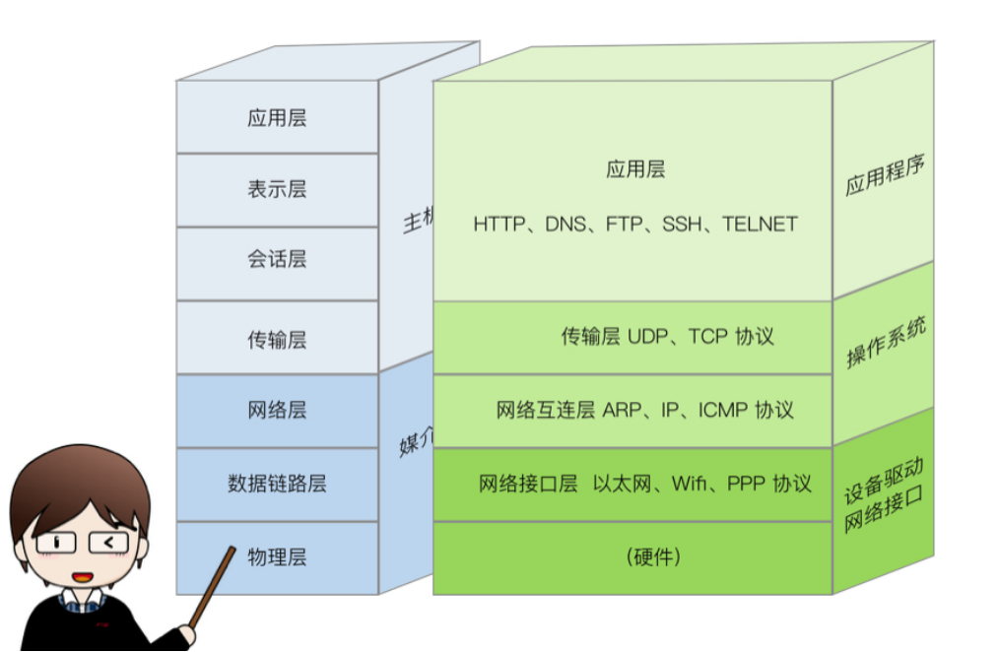
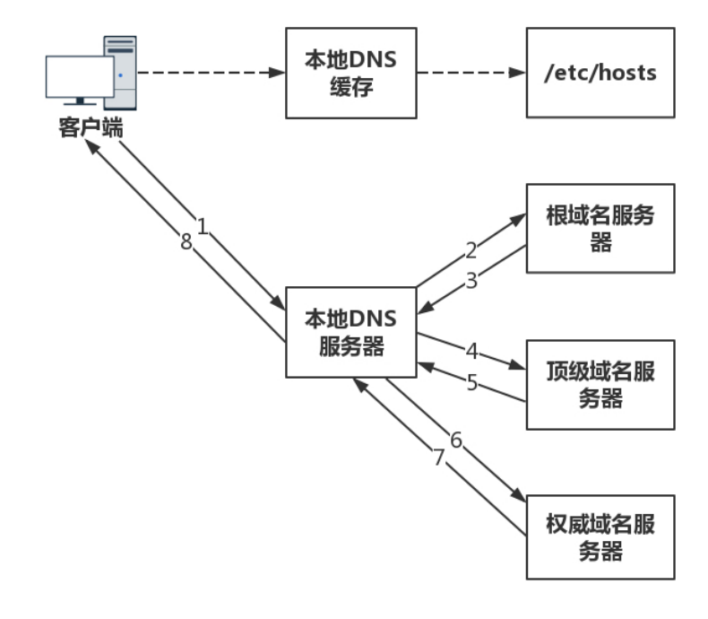
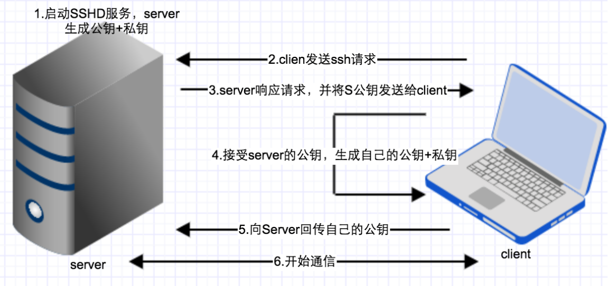

# 网络基本原理
* [基本概念](#基本概念)
    - [名词解释](#名词解释)
    - [网络分层](#网络分层)
    - [应用层协议——HTTP、DNS和SSH](#应用层协议——HTTP、DNS和SSH)

* [常见问题](#常见问题)
* [参考资料](#参考资料)  

## 基本概念
### 名词解释
#### 协议
网络协议，也可简称协议，由三要素组成：
* (1) 语法：即数据与控制信息的结构或格式；
* (2)语义：即需要发出何种控制信息，完成何种动作以及做出何种响应；
* (3)时序，即事件实现顺序的详细说明。

计算机通信网是由许多具有信息交换和处理能力的节点互连而成的。要使整个网络有条不紊地工作, 就要求每个节点必须遵守一些事先约定好的有关数据格式及时序等的规则。 这些为实现网络数据交换而建立的规则、约定或标准就称为网络协议。 协议是通信双方为了实现通信而设计的约定或通话规则。

协议总是指某一层的协议。准确地说，它是在同等层之间的实体通信时，有关通信规则和约定的集合就是该层协议，例如物理层协议、传输层协议、应用层协议。

#### 路由
1. 路由：路由是指导IP报文发送的路径信息。也可以理解为路由是寻找路径的过程。
2. 路由器：路由器具有路由的功能，作用是数据包转发。

#### VPN

1. VPN（虚拟专用网络）简单地说就是利用公网架设专用网络，VPN属于远程访问技术。
   比如我们要访问外国的某个网站，就可以利用虚拟专用网络（VPN）进行访问，也称之为“翻墙”。
2. 我们可以把中国看作成一个巨大的局域网，想要访问到国外的网站就要翻墙。
3. VSP：VSP是虚拟服务器，用户可以对VSP发起攻击，也可以在VSP上建立VPN。

#### 互联网（Internet）

互联网（internet），又称国际网络，指的是网络与网络之间所串连成的庞大网络，这些网络以一组通用的协议相连，形成逻辑上的单一巨大国际网络。

互联网始于1969年美国的阿帕网。通常internet泛指互联网，而Internet则特指因特网。这种将计算机网络互相联接在一起的方法可称作“网络互联”，在这基础上发展出覆盖全世界的全球性互联网络称互联网，即是互相连接一起的网络结构。互联网并不等同万维网，万维网只是一建基于超文本相互链接而成的全球性系统，且是互联网所能提供的服务其中之一。

互联网、因特网、万维网三者的关系是：互联网包含因特网，因特网包含万维网，凡是能彼此通信的设备组成的网络就叫互联网。所以，即使仅有两台机器，不论用何种技术使其彼此通信，也叫互联网。国际标准的互联网写法是Internet，因特网是互联网的一种。因特网可不是仅有两台机器组成的互联网，它是由上千万台设备组成的互联网。
因特网使用TCP/IP协议让不同的设备可以彼此通信。但使用TCP/IP协议的网络并不一定是因特网，一个局域网也可以使用TCP/IP协议。判断自己是否接入的是因特网，首先是看自己电脑是否安装了 TCP/IP协议，其次看是否拥有一个公网地址（所谓公网地址，就是所有私网地址以外的地址）。
因特网是基于TCP/IP协议实现的，TCP/IP协议由很多协议组成，不同类型的协议又被放在不同的层，其中，位于应用层的协议就有很多，比如FTP、HTTP、SMTP。只要应用层使用的是HTTP协议，就称为万维网（World Wide Web）。之所以在浏览器里输入百度网址时，能看见百度网提供的网页，就是因为您的个人浏览器和百度网的服务器之间使用的是HTTP协议在交流。

#### 防火墙
1. 防火墙是系统的第一道防线，其作用是防止非法用户的进入，防火墙是位于内网和外网之间的屏障，它按照系统管理员预先           定义好的规则来控制数据包的进出。
2. 防火墙的种类
* 网络层防火墙
* 应用层防火墙
* 数据库防火墙

#### 局域网与广域网
1. 局域网常用设备：HUB、交换机、路由器。
2. 局域网的特点：距离短，延迟小，传输速率高，传输可靠。
3. 广域网常用设备：Modern，路由器，广域网交换机，接入服务器。
4. 外网常用光纤来传递信号（光纤通过光信号传播，光纤不可折）

#### IP地址(网络协议地址）
1. IP地址是一个32位的二进制数，通常被分割为4个“8位二进制数”（也就是4个字节），IP地址通常用点分十进制表示成（a.b.c.d）的形式，其中a,b,c,d都是0-255之间的十进制整数。
2. IP地址在网络层唯一标识一台网络设备。 ip地址包含两部分：网络位和主机位
  
###  网络分层

#### 1、 应用层：为操作系统或网络应用程序提供访问网络服务的接口。   

应用层任务是通过应用进程间的交互来完成特定网络应用。

应用层协议的代表包括：FTP、HTTP、SMTP等。

#### 2、运输层：负责向两个主机中进程之间的通信提供服务。运输层还要处理端到端的差错检测(与数据链路层不同)、拥塞控制、流量控制等问题。

运输层协议的代表包括：TCP（面向连接、可靠数据传输服务，数据传输单位是报文段）、UDP（无连接。尽最大努力的数据传输服务，数据传输单位是用户数据报）等。    

#### 3、网络层：负责对子网间的数据包进行路由选择，为分组交换网上的不同主机提供通信服务。

网络层协议的代表包括：IP、ICMP、IGMP等。   

#### 4、数据链路层：数据的封装成帧、数据的透明传输、数据的差错检测。

数据链路层协议的代表包括：PPP、帧中继等。  

#### 5、物理层：通过传输介质发送和接收二进制比特流。

属于物理层定义的典型规范如RJ-45等。  
    
### 应用层协议——HTTP、DNS和SSH
#### http协议
超文本传输协议（ Hyper Text Transfer Protocol ），是用于传输诸如HTML的超媒体文档的应用层协议。它被设计用于Web浏览器和Web服务器之间的通信，但也可以用于其它目的。 HTTP遵循经典的客户端-服务端模型，客户端打开一个连接以发出请求，然后等待收到服务器端的响应。 HTTP是无状态协议，意味着服务器不会在两个请求之间保留任何数据（状态）。虽然通常基于TCP / IP层，但可以在任何可靠的传输层上使用，也就是说，一个不会静默丢失消息的协议，如UDP。
#### DNS协议
1. 定义：DNS是域名系统(DomainNameSystem)的缩写，该系统用于命名组织到域层次结构中的计算机和网络服务。域名是由圆点分开一串单词或缩写组成的，每一个域名都对应一个惟一的IP地址，在Internet上域名与IP地址之间是一一对应的，DNS就是进行域名解析的服务器。
2. DNS服务器：域名与IP地址之间的对应，类似于地址簿。DNS服务器在日常生活十分重要，每个人上网，都需要访问它，但是同时，这对它来讲也是非常大的挑战。一旦它出了故障，整个互联网都将瘫痪。另外，上网的人分布在全世界各地，如果大家都去同一个地方访问某一台服务器，时延将会非常大。因而，DNS 服务器一定要设置成高可用、高并发和分布式的。
3. 根服务器：根服务器主要用来管理互联网的主目录，全世界只有13台（这13台根域名服务器名字分别为“A”至“M”），1个为主根服务器在美国。其余12个均为辅根服务器，其中9个在美国，欧洲2个，位于英国和瑞典，亚洲1个位于日本。所有根服务器均由美国政府授权的互联网域名与号码分配机构ICANN统一管理，负责全球互联网域名根服务器、域名体系和IP地址等的管理，这13台根服务器可以指挥Firefox或Internet Explorer这样的Web浏览器和电子邮件程序控制互联网通信，由于根服务器中有经美国政府批准的260个左右的互联网后缀（如.com、.xyz、.net、.top等）和一些国家的指定符（如法国的.fr、挪威的.no等），美国政府对其管理拥有很大发言权。
5. 本机hosts的作用：
    * （1）加快域名解析：对于要经常访问的网站，我们可以通过在hosts中配置域名和IP的映射关系，这样当我们输入域名计算机就能很快解析出IP，而不用请求网络上的DNS服务器。
    * （2）方便局域网用户：在很多单位的局域网中，会有服务器提供给用户使用。但由于局域网中一般很少架设DNS服务器，访问这些服务要输入难记的IP地址，对不少人来说相当麻烦。现在可以分别给这些服务器取个容易记住的名字，然后在Hosts中建立IP映射，这样以后访问的时候我们输入这个服务器的名字就行了。
    * （3）屏蔽网站：现在有很多网站不经过用户同意就将各种各样的插件安装到你的计算机中，有些说不定就是木马或病毒。对于这些网站我们可以利用Hosts把该网站的域名映射到错误的IP或自己计算机的IP，这样就不用访问了。我们在Hosts写上以下内容：127.0.0.1#屏蔽的网站，0.0.0.0#屏蔽的网站，这样计算机解析域名就解析到本机或错误的IP，达到了屏蔽的目的。
    * （4）顺利连接系统：对于Lotus的服务器和一些数据库服务器，在访问时如果直接输入IP地址那是不能访问的，只能输入服务器名才能访问，那么我们配置好hosts文件，这样输入服务器名就能顺利连接了。
    * 最后要指出的是，hosts文件配置的映射是静态的，如果网络上的计算机更改了请及时更新IP地址，否则将不能访问。

#### SSH协议
1. 定义：SSH 为 Secure Shell 的缩写，由 IETF 的网络小组所制定。1995年，芬兰学者Tatu Ylonen设计了SSH协议，将登录信息全部加密，成为互联网安全的一个基本解决方案，迅速在全世界获得推广，目前已经成为Linux系统的标准配置。SSH 为建立在应用层基础上的安全协议，目前较可靠，专为远程登录会话和其他网络服务提供安全性的协议。利用 SSH 协议可以有效防止远程管理过程中的信息泄露问题。简单说，SSH是一种网络协议，用于计算机之间的加密登录。

2. 功能：最早的时候，互联网通信都是明文通信的，传统的网络服务程序，如ftp、pop和telnet在本质上都是不安全的，因为它们在网络上用明文传送口令和数据，别有用心的人非常容易就可以截获这些口令和数据，一旦被截获，内容就暴露无疑，而且，这些服务程序的安全验证方式也是有其弱点的， 就是很容易受到“中间人”（man-in-the-middle）这种方式的攻击。所谓“中间人”的攻击方式， 就是“中间人”冒充真正的服务器接收你传给服务器的数据，然后再冒充你把数据传给真正的服务器。服务器和你之间的数据传送被“中间人”一转手做了手脚之后，就会出现很严重的问题。通过使用SSH，你可以把所有传输的数据进行加密，这样"中间人"这种攻击方式就不可能实现了，而且也能够防止DNS欺骗和IP欺骗。使用SSH，还有一个额外的好处就是传输的数据是经过压缩的，所以可以加快传输的速度。SSH有很多功能，它既可以代替Telnet，又可以为FTP、PoP、甚至为PPP提供一个安全的"通道"。如果一个用户从本地计算机，使用SSH协议登录另一台远程计算机，我们就可以认为，这种登录是安全的，即使被中途截获，密码也不会泄露。
需要指出的是，SSH只是一种协议，存在多种实现，既有商业实现，也有开源实现。
3. SSH协议流程

密钥的工作分为两种机制：加密机制和认证机制。

例如：A和B之间需要加密传输信息，那么A和B首先需要各自产生自己的私钥和公钥，记为公钥A，私钥A和公钥B和私钥B，然后A把公钥A发给B，B把公钥B发给A，那么接下来就可以进行加密传输了。

加密机制：B向A传输信息，则B用公钥A加密信息后发送给A，A收到后使用私钥A解密B发来的信息，这就是加密机制；

认证机制：A向B传输信息，A使用私钥A加密信息后发送给B，B收到后使用公钥A尝试解密资料，结果成功解密，说明这个资料是由A发送的，这就是认证机制。

## 常见问题
* URI和URL的区别是什么?

    URI(Uniform Resource Identifier) 是统一资源标志符，可以唯一标识一个资源。
    
    URL(Uniform Resource Location) 是统一资源定位符，可以提供该资源的路径。它是一种具体的 URI，即 URL 可以用来标识一个资源，而且还指明了如何 locate 这个资源。
    
    URI的作用像身份证号一样，URL的作用更像家庭住址一样。URL是一种具体的URI，它不仅唯一标识资源，而且还提供了定位该资源的信息。

## 参考资料
* https://baike.baidu.com/item/%E4%BA%92%E8%81%94%E7%BD%91/199186
* https://cn.udacity.com/course/networking-for-web-developers--ud256
* https://www.html5rocks.com/en/tutorials/internals/howbrowserswork/
* http://www.ruanyifeng.com/blog/2011/12/ssh_remote_login.html
