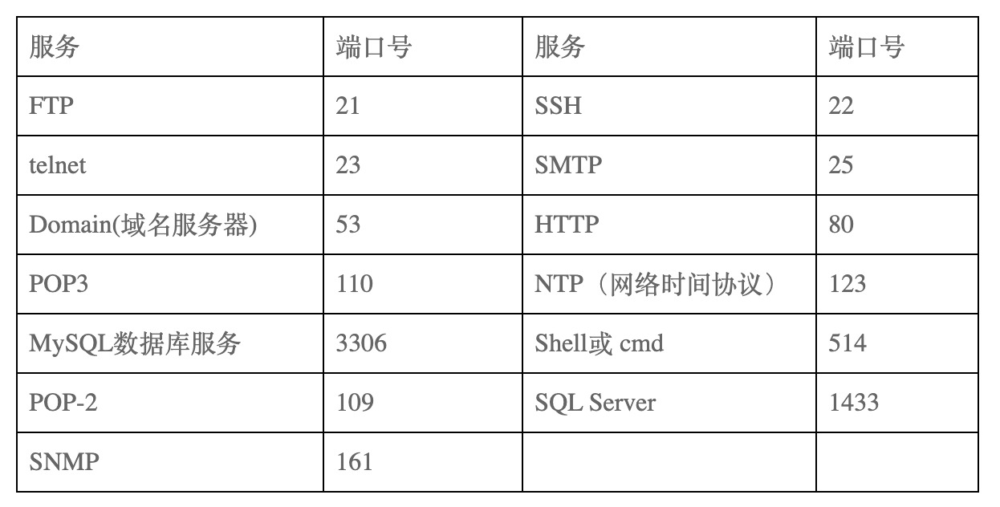

# URL，DNS，域名，FTP等

* [基本概念](#基本概念)
    - [URL](#URL)
    - [DNS和域名](#DNS和域名)
    - [FTP](#FTP)
    - [SMTP](#SMTP)
* [常见问题](#常见问题)
* [参考资料](#参考资料)  

## 基本概念

### URL
https://baike.baidu.com/item/%E7%BB%9F%E4%B8%80%E8%B5%84%E6%BA%90%E5%AE%9A%E4%BD%8D%E7%B3%BB%E7%BB%9F

### DNS和域名
https://baike.baidu.com/item/%E5%9F%9F%E5%90%8D

https://baike.baidu.com/item/%E5%9F%9F%E5%90%8D%E7%B3%BB%E7%BB%9F

### FTP
https://baike.baidu.com/item/ftp/13839

### SMTP
https://baike.baidu.com/item/SMTP/175887

## 常见问题
* 端口及对应的服务？

* Internet上保留了哪些IP地址用于内部？
    - A类：10.0.0.0——10.255.255.255
    - B类：172.16.0.0——172.31.255.255
    - C类：192.168.0.0——192.168.255.255

## 参考资料
* http://blog.chinaunix.net/uid-25132162-id-362682.html
