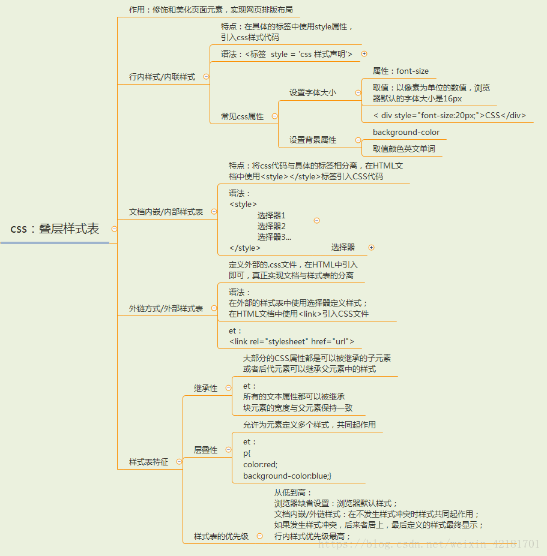
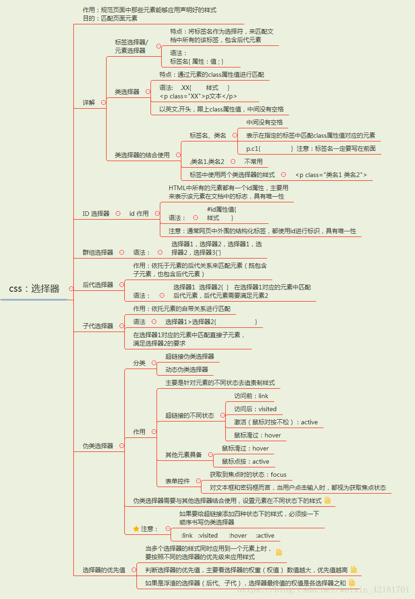
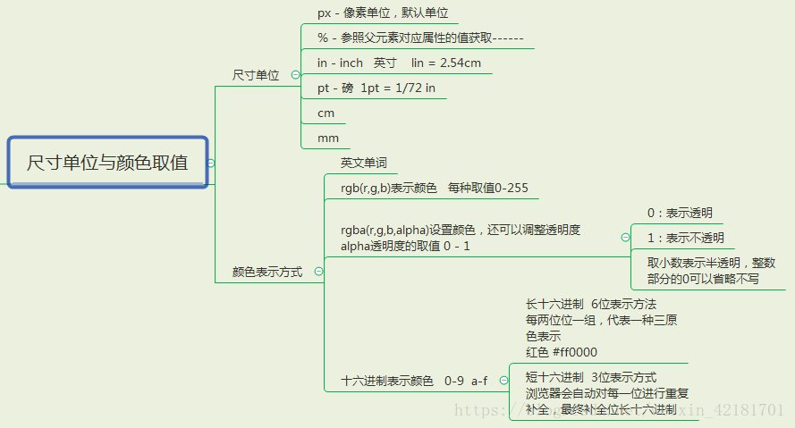
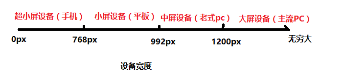
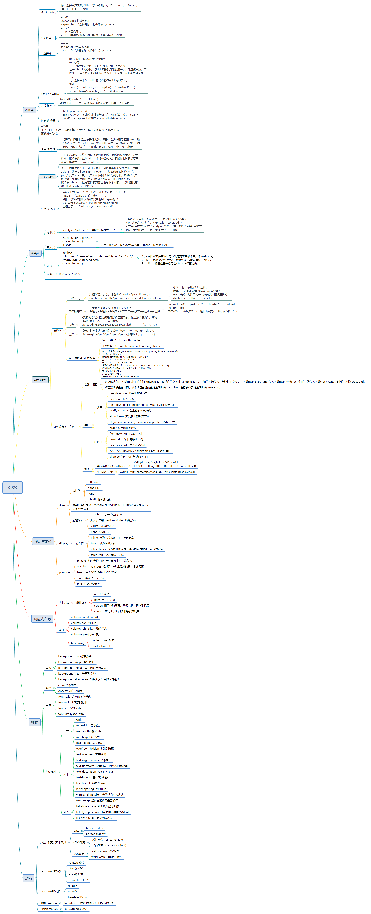

# CSS

* [基础](#基础)
* [Layout](#Layout)
* [响应式设计](#响应式设计)
* [参考文档](#参考文档)

## 基础
- CSS基本概念
  - [CSS文档](https://developer.mozilla.org/zh-CN/docs/Learn/Getting_started_with_the_web/CSS_basics)
  - CSS 概括
   
- CSS 常用样式属性
  - [背景属性](https://www.runoob.com/css/css-background.html)
  - [文本属性](https://www.runoob.com/css/css-text.html)
  - [字体属性](https://www.runoob.com/css/css-font.html)
- CSS 选择器
   
- CSS 尺寸单位与颜色取值
   
- [CSS动画](http://www.ruanyifeng.com/blog/2014/02/css_transition_and_animation.html)
## Layout
### 1. 浮动
 - [css浮动和清除浮动](https://www.jianshu.com/p/09bd5873bed4)
### 2. 定位
 - [css定位详解](https://ruanyifeng.com/blog/2019/11/css-position.html)
### 3. display
 - [display属性](https://www.runoob.com/cssref/pr-class-display.html)
 - [display与visibility](https://www.runoob.com/css/css-display-visibility.html)
### 4. 盒模型
 - [盒模型概念](https://www.runoob.com/css/css-boxmodel.html)
 - [深入理解盒模型](https://www.cnblogs.com/chengzp/p/cssbox.html)
### 5. Grid
 - [网格布局](http://www.ruanyifeng.com/blog/2019/03/grid-layout-tutorial.html)
### 6. Flex
- [Flex布局](http://www.ruanyifeng.com/blog/2015/07/flex-grammar.html)
## 响应式设计
 1. 响应式布局的介绍
 ```
   响应式布局（respond layout）是Ethan Marcotte在2010年5月份提出的一个概念，简而言之，就是一个网站能够兼容多个终端（pc、手机、平板）
 ```

 2. 响应式开发中，设备屏幕的分类

      |分类名称| 响应式开发 |
      |  ----  | ----  |
      |超小屏设备|0 ~ 768px|
      |小屏设备|768px ~ 992px|
      |中屏设备|992px ~ 1200px|
      |大屏设备|1200px ~ 正无穷|
      
3. 实现响应式的方法
   1. 媒体查询
   - 媒体查询（Media Query)：是CSS3新增的方法，可以通过动态查询屏幕的宽度，根据不同的屏幕宽度设置样式是否生效！！

   ```javascript
   @media screen and (条件) {
      选择器......
   }
   /* 样式生效的最小宽为600px——》只有当屏幕宽度大于等于600px时，样式才会生效！！*/
   @media screen and (min-width:600px) {
      div {
         width: 400px;
         height: 400px;
         background-color: green;
      }
   }
      //   作用： 只有当屏幕宽度满足条件时，媒体查询中的选择器才能生效！！！

      // 注意点： 媒体查询仅仅只是控制选择器是否生效，不会提升选择器的优先级！！

      // 具体谁说了算，还是需要看优先级

   ```
   2. [CSS—viewport视口详解](https://blog.csdn.net/weixin_42472040/article/details/104158020)

   3. [px, em, rem](https://www.runoob.com/w3cnote/px-em-rem-different.html)

   4. [瀑布流](https://www.php.cn/css-tutorial-409347.html)

## 面试题
1. [经典面试题](https://www.php.cn/css-tutorial-457233.html)
## 参考文档
 - [css文档](https://www.w3school.com.cn/css/index.asp)
 - [响应式布局教程](https://juejin.cn/post/6844903814332432397)
 - CSS大纲图
 