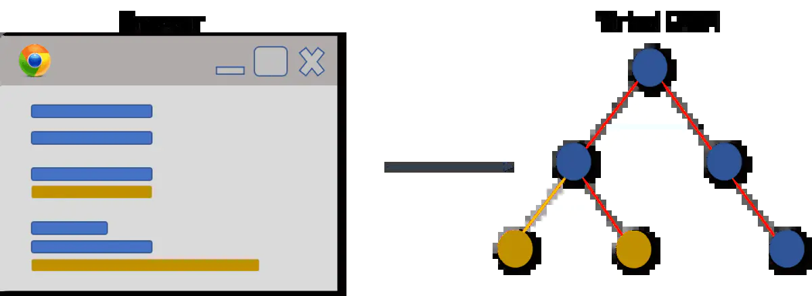
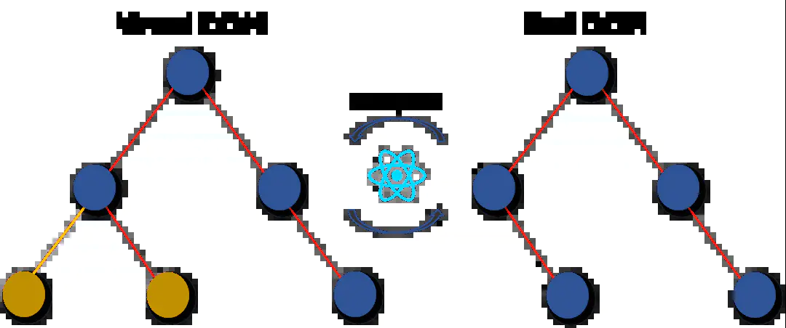
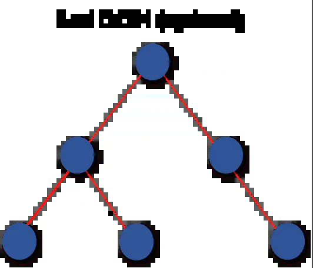

# React

* [基础概念](#基础概念)
  - [官方文档](#官方文档)
  - [项目起步](#项目起步)
  - [react和react-dom](#react和react-dom)
  - [组件](#组件)
  - [组件复合](#组件复合)
  - [生命周期](#生命周期)
  - [vscode插件](#vscode插件)
* [进阶](#进阶)
  - [Refs](#Refs)
  - [Refs转发](#Refs转发)
  - [组件跨层级通信-Context](#组件跨层级通信-Context)
  - [高阶组件(HOC)](#高阶组件(HOC))
  - [HOOK](#HOOK)
* [常见问题](#常见问题)

## 基础概念

### 官方文档
- [React](https://react.docschina.org/docs/getting-started.html)
- [create-react-app](https://create-react-app.dev/docs/getting-started/)

### 项目起步
1. 创建项目: `npx create-react-app my-app`
2. 打开项目: `cd my-app `
3. 启动项目: `npm start`
4. 暴露配置项(不可逆): `npm run eject`

### react和react-dom
- react
  - 负责逻辑控制，数据->VDOM
- react-dom
  - 渲染实际 DOM，VDOM->DOM

### 组件
- class 组件
  - class 组件通常拥有状态和生命周期，继承于 Component，实现 render 方法。
- function 组件
  > 从 React16.8 开始引入了 hooks，函数组件也能够拥有状态
  - 函数组件通常无状态，仅关注内容展示，返回渲染结果即可。

### 组件复合
React 有十分强大的组合模式。我们推荐使用组合而非继承来实现组件间的代码重用。

- 包含关系

  1. 使用一个特殊的`children`prop 来将他们的子组件传递到渲染结果中。
     ```ts
     function FancyBorder(props) {
       return <div>{props.children}</div>;
     }
     ```
     别的组件可以通过 JSX 嵌套，将任意组件作为子组件传递给它们。
     ```ts
     function WelcomeDialog() {
       return (
         <FancyBorder color="blue">
           <h1 className="Dialog-title">Welcome</h1>
           <p className="Dialog-message">
             Thank you for visiting our spacecraft!
           </p>
         </FancyBorder>
       );
     }
     ```
  2. 不使用`children`，而是自行约定：将所需内容传入 props，并使用相应的 prop。

     ```ts
     function SplitPane(props) {
       return (
         <div className="SplitPane">
           <div className="SplitPane-left">{props.left}</div>
           <div className="SplitPane-right">{props.right}</div>
         </div>
       );
     }

     function App() {
       return <SplitPane left={<Contacts />} right={<Chat />} />;
     }
     ```

     `<Contacts />`和`<Chat />`之类的 React 元素本质就是对象（object），所以你可以把它们当作 props，像其他数据一样传递。这种方法可能使你想起别的库中“槽”（slot）的概念，但在 React 中没有“槽”这一概念的限制，你可以将任何东西作为 props 进行传递。

- 特例关系

  - 有些时候，我们会把一些组件看作是其他组件的特殊实例，比如`WelcomeDialog`可以说是`Dialog`的特殊实例。在 React 中，我们也可以通过组合来实现这一点。“特殊”组件可以通过 props 定制并渲染“一般”组件：

    ```ts
    function Dialog(props) {
      return (
        <FancyBorder color="blue">
          <h1 className="Dialog-title">{props.title}</h1>
          <p className="Dialog-message">{props.message}</p>
        </FancyBorder>
      );
    }

    function WelcomeDialog() {
      return (
        <Dialog
          title="Welcome"
          message="Thank you for visiting our spacecraft!"
        />
      );
    }
    ```

### 生命周期

- [深入详解 React 生命周期](https://juejin.cn/post/6914112105964634119)
- React 生命周期改版原因：[React Fiber](https://zhuanlan.zhihu.com/p/26027085?utm_source=wechat_session&utm_medium=social&utm_oi=41216360054784&wechatShare=1&s_r=0) 会影响部分生命周期函数的执行

### vscode插件

1. Simple React Snippets:快速生成模版代码

## 进阶

### Refs
>Refs 提供了一种方式，允许我们访问 DOM 节点或在 render 方法中创建的 React 元素。

1. 作用对象
	```js
	this.myRef = React.createRef()

	// const ref = useRef()
	```
	- HTML
	```html
	<div ref={this.myRef}></div>
	```
	- class组件
	```html
	<ClassComponent ref={this.myRef}></ClassComponent>
	```
	**不能作用于函数组件，但可以在函数组件中使用**

2. 访问ref对象
	```js
	const node = this.myRef.current
	```
	- 作用于HTML，接收底层DOM
	- 作用于组件，接收组件实例
	
### Refs转发
>Ref 转发是一个可选特性，其允许某些组件接收 ref，并将其向下传递（换句话说，“转发”它）给子组件。
```js
const FancyButton = React.forwardRef((props, ref) => (
	<button ref={ref} className="FancyButton">
		{props.children}
	</button>
));

// 你可以直接获取 DOM button 的 ref：
const ref = React.createRef();
<FancyButton ref={ref}>Click me!</FancyButton>;
```

### 组件跨层级通信-Context
1. [官方文档](https://react.docschina.org/docs/context.html)
2. 特点
    - Context 提供了一个无需为每层组件手动添加 props，就能在组件树间进行数据传递的方法
    - 使用 context, 我们可以避免通过中间元素传递 props
3. 使用场景
    - 管理当前的locale
	- theme
	- 缓存数据
4. 核心API
	- `React.createContext`
		```ts
		const MyContext = React.createContext(defaultValue);
		```
		- 创建一个Context对象
	- `Context.Provider`
		```ts
		<MyContext.Provider value={/* 某个值 */}>
		```
		- 为组件树之间的数据传递提供环境
		- Provider 接收一个 value 属性，传递给消费组件
		- 当 Provider 的 value 值发生变化时，它内部的所有消费组件都会重新渲染
	- `Class.contextType`
		```ts
		class MyClass extends React.Component {
			componentDidMount() {
				let value = this.context;
				/* 在组件挂载完成后，使用 MyContext 组件的值来执行一些有副作用的操作 */
			}
			componentDidUpdate() {
				let value = this.context;
				/* ... */
			}
			componentWillUnmount() {
				let value = this.context;
				/* ... */
			}
			render() {
				let value = this.context;
				/* 基于 MyContext 组件的值进行渲染 */
			}
		}
		MyClass.contextType = MyContext;
		```
		- 挂载在class上的contextType会取到Provider上的value值并挂载到this.context上
		- 只能通过这个API订阅单一的context
		- 只能在类组件中使用
	- `Context.Consumer`
		```ts
		<MyContext.Consumer>
			{value => /* 基于 context 值进行渲染*/}
		</MyContext.Consumer>
		```
		- 需要函数作为子元素，这个函数接收当前的context值，返回一个react节点
		- 可以订阅多个context，传递给函数的value值等同于往上组件树离这个context最近的Provider提供的value值

### 高阶组件(HOC)
1. [官方文档](https://react.docschina.org/docs/higher-order-components.html)
2. 特点
	- 高阶组件不是一个组件，他是参数为组件，返回值为新组件的函数
	- HOC是纯函数，没有副作用
		- HOC 不会修改传入的组件，也不会使用继承来复制其行为。相反，HOC 通过将组件包装在容器组件中来组成新组件。
3. 基本使用
	```ts
	import React, {Component} from "react";
	
	const foo = Cmp => props => {
		return (
			<div className="border"> 
				<Cmp {...props} />
			</div>
		);
	};

	function Child(props) {
		return <div> Child {props.name}</div>; 
	}

	const Foo = foo(Child);
	export default class HocPage extends Component {
		render() {
			return (
				<div> 
					<h3>HocPage</h3> 
					<Foo name="msg" />
				</div>
			);
		}
	}
	```
4. 链式调用
	```ts
	const Foo = foo(foo(Child));

### HOOK
> Hook 是 React 16.8 的新增特性。它可以让你在不编写 class 的情况下使用 state 以及其他的 React 特性。

1. [官方文档](https://zh-hans.reactjs.org/docs/hooks-intro.html)
2. [HOOK API](https://zh-hans.reactjs.org/docs/hooks-reference.html)
	- 基础HOOK
		- `useState`
		- `useEffect`
		- `useContext`
	- 额外的HOOK
		- `useReducer`
		- `useCallback`
		- `useMemo`
		- `useRef`
		- `useImperativeHandle`
		- `useLayoutEffect`
		- `useDebugValue`

### 常见问题

1. [简述react diff](https://zhuanlan.zhihu.com/p/20346379)
2. 简述 Virtual DOM 的工作原理
- Virtual DOM 是一个轻量级的 JavaScript 对象，它最初只是 real DOM 的副本。它是一个节点树，它将元素、它们的属性和内容作为对象及其属性。 React 的渲染函数从 React 组件中创建一个节点树。然后它响应数据模型中的变化来更新该树，该变化是由用户或系统完成的各种动作引起的。
- Virtual DOM 工作过程有三个简单的步骤。

	- 每当底层数据发生改变时，整个 UI 都将在 Virtual DOM 描述中重新渲染。
	
	- 然后计算之前 DOM 表示与新表示的之间的差异。
	
	- 完成计算后，将只用实际更改的内容更新 real DOM。
	

