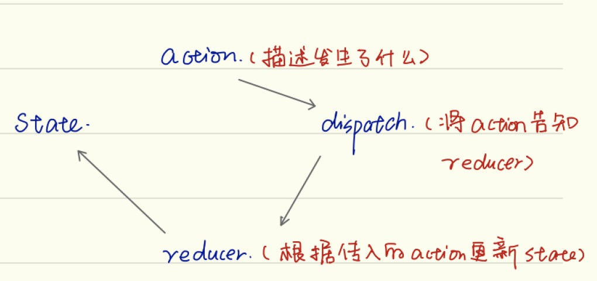
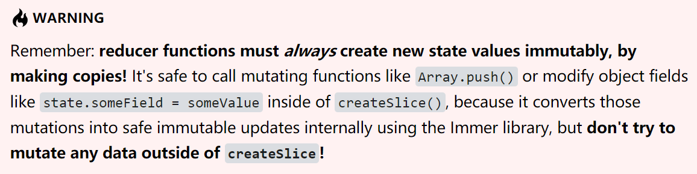

# Redux

* [Redux](https://redux.js.org/introduction/getting-started)
    - [核心概念](#核心概念)
        - [Action](#Action)
        - [Action Creators](#ActionCreators)
        - [Reducers](#Reducers)
        - [Store](#Store)
        - [Dispatch](#Dispatch)
        - [Selectors](#Selectors)
    - [基本的Redux数据流](#基本的Redux数据流)
        - [创建一个新的React+Redux项目](#创建一个新的React+Redux项目)
        - [创建Slice](#创建Slice)
        - [展示Redux数据](#展示Redux数据)
        - [添加新的Redux数据](#添加新的Redux数据)
    - [处理异步逻辑](#处理异步逻辑)
        - [使用createAsyncThunk获取数据](#使用createAsyncThunk获取数据)
        - [组件中dispatch异步方法](#组件中dispatch异步方法)
        - [根据createAsyncThunk返回的数据更新state](#根据createAsyncThunk返回的数据更新state)
* [参考资料](#参考资料)


## 核心概念
The only way to change the state tree is to create an action, an object describing what happened, and dispatch it to the store.

To specify how state gets update in response to an action, you write pure reducer functions that cacluate a new state based on the old state and the action.



### Action
A plain Javascript object that has a type field.You can think of an action as an event that describes something that happened in the application.
- type(domian/eventName)
    - domain : The feature or category that this action belongs to.
    - eventName : The specific thing that happened.
- payload
    - An action object can have other fileds with additional information about what happened.

```javascript
const addTodoAction = {
    type: 'todos/todoAdded',
    payload: 'Buy milk'
}
```

### ActionCreators
An action creator is a function that creates and returns an action object. We typically use these so we don't have to write the action object by hand every time

```javascript
const addTodo = text => {
  return {
    type: 'todos/todoAdded',
    payload: text
  }
}
```

### Reducers
A reducer is a function that receives the current state and an action object, decides how to update the state if necessary, and return the new state.

The logic inside reducer functions typically follows the same series of steps:
1. Check to see if the reducer cares about this action. If so, make a copy of the state, update the copy with new values, and return it.

2. Otherwise, return the existing state unchange.

```javascript
const initialState = {
    value: 0
}

function counterReducer(state = initialState, action){
    if(action.type === 'counter/increment'){
        return {
            ...state,
            value: state.value + 1
        }
    }
    return state
}
```

### Store
The current Redux application state live in an object called the store.

The store is created by passing in a reducer, and has a method called getState that returns the current state value.

```javascript
import { configStore } from '@reactjs/toolkit'

const store = configStore({
    reducer: counterReducer
})

console.log(store.getState())
```

### Dispatch
The Redux state has a method called dispatch. The only way to update the state is to call `store.dispatch` and pass in an action object. The store will run its reducer function and save the new state value inside, and we can call `getState()` to retrieve the update value.

```javascript
const increment = () => {
    return {
        type: 'counter/increment'
    }
}

store.dispatch(increment())
console.log(store.getState())
```

### Selectors
Selectors are functions that know how to extract specific pieces of information from a store state value. As an application grows bigger, this can help avoid repeating logic as different parts of the app need to read the same data.

```javascript
const selectCounterValue = state => state.value
const currentValue = selectCounterValue(store.getState())
```

## 基本的Redux数据流

### 创建一个新的React+Redux项目
1. 使用Create React App
    ```
    npx create-react-app my-app --template redux-typescript
    ```
2. [github](https://github.com/reduxjs/cra-template-redux)

### 创建Slice
1. We're going to use the Redux Toolkit `createSlice` function to make a reducer function that knows how to handle our posts data. Reducer functions need to have some initial data included so that the Redux store has those values loaded when the app starts up.

    ```javascript
    import { createSlice } from '@reduxjs/toolkit'

    const initialState = [
        { id: '1', title: 'First Post!', content: 'Hello!' },
        { id: '2', title: 'Second Post', content: 'More text' }
    ]

    const postsSlice = createSlice({
        name: 'posts',
        initialState,
        reducers: {}
    })

    export default postsSlice.reducer
    ```
2. Add its reducer function to our Redux store 

    ```javascript
    import { configureStore } from '@reduxjs/toolkit'

    import postsReducer from '../features/posts/postsSlice'

    export default configureStore({
        reducer: {
            posts: postsReducer
        }
    })
    ```

### 展示redux数据
Read data from the Redux store using the `useSelector` hook from the React-Redux library. 

The "selector functions" that you write will be called with the entire Redux state object as a parameter, and should return the specific data that this component needs from the store.

```javascript
    import React from 'react'
    import { useSelector } from 'react-redux'

    export const PostsList = () => {
        const posts = useSelector(state => state.posts)

        const renderedPosts = posts.map(post => (
            <article className="post-excerpt" key={post.id}>
                <h3>{post.title}</h3>
                <p className="post-content">{post.content.substring(0, 100)}</p>
            </article>
        ))

        return (
            <section className="posts-list">
                <h2>Posts</h2>
                {renderedPosts}
            </section>
        )
    }
```

### 添加新的redux数据
1. Inside of reducers, add a function named postAdded, which will receive two       arguments: the current state value, and the action object that was dispatched. 

    When we write the postAdded reducer function, createSlice will automatically generate an "action creator" function with the same name. We can export that action creator and use it in our UI components to dispatch the action.
    ```javascript
    const postsSlice = createSlice({
        name: 'posts',
        initialState,
        reducers: {
            postAdded(state, action) {
                state.push(action.payload)
            }
        }
    })

    export const { postAdded } = postsSlice.actions

    export default postsSlice.reducer
    ```

2. Add a click handler that will dispatch the postAdded action creator and pass in a new post object containing the title and content the user wrote.

    In order to dispatch actions from a component, we need access to the store's dispatch function. We get this by calling the useDispatch hook from React-Redux. We also need to import the postAdded action creator into this file.

    ```javascript
    import React, { useState } from 'react'
    import { useDispatch } from 'react-redux'
    import { nanoid } from '@reduxjs/toolkit'

    import { postAdded } from './postsSlice'

    export const AddPostForm = () => {
        const [title, setTitle] = useState('')
        const [content, setContent] = useState('')

        const dispatch = useDispatch()

        const onTitleChanged = e => setTitle(e.target.value)
        const onContentChanged = e => setContent(e.target.value)

        const onSavePostClicked = () => {
            if (title && content) {
                dispatch(
                    postAdded({
                        id: nanoid(),
                        title,
                        content
                    })
                )

                setTitle('')
                setContent('')
            }
        }

        return (
            <section>
                <h2>Add a New Post</h2>
                <form>
                    <label htmlFor="postTitle">Post Title:</label>
                    <input
                        type="text"
                        id="postTitle"
                        name="postTitle"
                        value={title}
                        onChange={onTitleChanged}
                    />
                    <label htmlFor="postContent">Content:</label>
                    <textarea
                        id="postContent"
                        name="postContent"
                        value={content}
                        onChange={onContentChanged}
                    />
                    <button type="button" onClick={onSavePostClicked}>
                    Save Post
                    </button>
                </form>
            </section>
        )
    }
    ```

    ## 处理异步逻辑
    There are many kinds of async middleware for Redux, and each lets you write your logic using different syntax. The most common async middleware is redux-thunk, which lets you write plain functions that may contain async logic directly. Redux Toolkit's configureStore function automatically sets up the thunk middleware by default, and we recommend using thunks as the standard approach for writing async logic with Redux.

    

    ### 使用createAsyncThunk获取数据
    Redux Toolkit's createAsyncThunk API generates thunks that automatically dispatch those "start/success/failure" actions for you.
    
    ```javascript
    import { createSlice, nanoid, createAsyncThunk } from '@reduxjs/toolkit'
    import { client } from '../../api/client'

    const initialState = {
        posts: [],
        status: 'idle',
        error: null
    }

    export const fetchPosts = createAsyncThunk('posts/fetchPosts', async () => {
        const response = await client.get('/fakeApi/posts')
        return response.posts
    })
    ```
    `createAsyncThunk` accepts two arguments:
    - A string that will be used as the prefix for the generated action types
    - A "payload creator" callback function that should return a Promise containing some data, or a rejected Promise with an error

    ### 组件中dispatch异步方法
    ```javascript
    import React, { useEffect } from 'react'
    import { useSelector, useDispatch } from 'react-redux'
    // omit other imports
    import { selectAllPosts, fetchPosts } from './postsSlice'

    export const PostsList = () => {
        const dispatch = useDispatch()
        const posts = useSelector(selectAllPosts)

        const postStatus = useSelector(state => state.posts.status)

        useEffect(() => {
            if (postStatus === 'idle') {
                dispatch(fetchPosts())
            }
        }, [postStatus, dispatch])

        // omit rendering logic
    }
    ```

    ### 根据createAsyncThunk返回的数据更新state

    ```javascript
    export const fetchPosts = createAsyncThunk('posts/fetchPosts', async () => {
        const response = await client.get('/fakeApi/posts')
        return response.posts
    })

    const postsSlice = createSlice({
        name: 'posts',
        initialState,
        reducers: {
            // omit existing reducers here
        },
        extraReducers: {
            [fetchPosts.pending]: (state, action) => {
                state.status = 'loading'
            },
            [fetchPosts.fulfilled]: (state, action) => {
                state.status = 'succeeded'
                // Add any fetched posts to the array
                state.posts = state.posts.concat(action.payload)
            },
            [fetchPosts.rejected]: (state, action) => {
                state.status = 'failed'
                state.error = action.error.message
            }
        }
    })
    ```

## 参考资料
- [官方文档](https://redux.js.org/introduction/getting-started)
- [redux-toolkit](https://redux-toolkit.js.org/introduction/quick-start)
- [Redux 入门教程（一）：基本用法](http://www.ruanyifeng.com/blog/2016/09/redux_tutorial_part_one_basic_usages.html)
- [Redux 入门教程（二）：中间件与异步操作](http://www.ruanyifeng.com/blog/2016/09/redux_tutorial_part_two_async_operations.html)
- [Redux 入门教程（三）：React-Redux 的用法](http://www.ruanyifeng.com/blog/2016/09/redux_tutorial_part_three_react-redux.html)