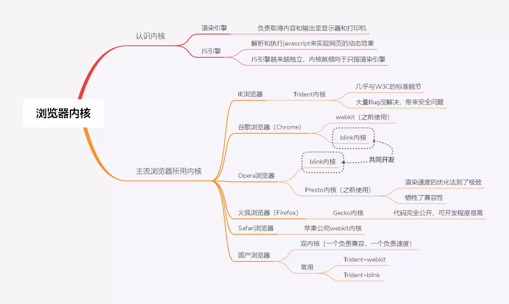
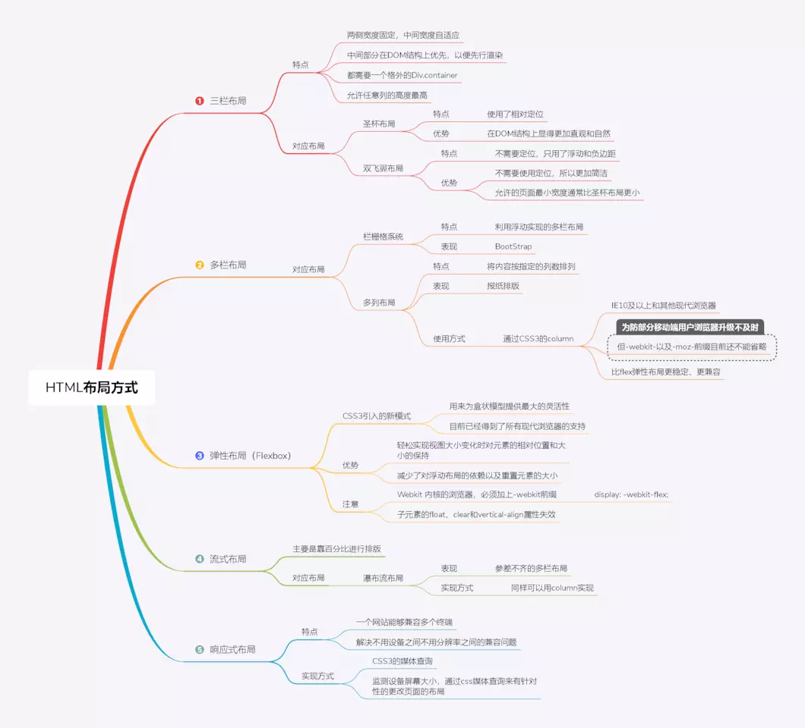
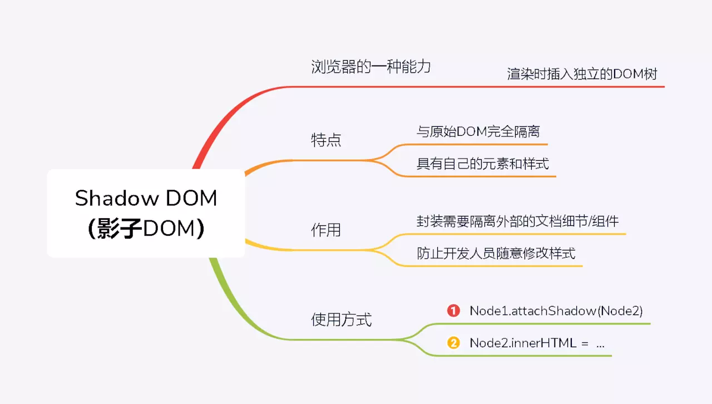

# HTML

* [基础](#基础)
* [语义化](#语义化)
* [表单和校验](#表单和校验)
* [SEO](#SEO)

## 基础

### 1. HTML入门
 - [基本概念](https://developer.mozilla.org/zh-CN/docs/Web/HTML)
 - [HTML标签手册](https://www.w3school.com.cn/tags/html_ref_byfunc.asp)
- HTML基本结构


### 2. HTLM进阶

 1. HTML5 概括
  
 2. [HTML5标签手册](https://www.w3cschool.cn/html5/)
 3. HTML5 的元素分类
  
### 3. 面试题
1. 浏览器页面构成


2. 浏览器内核相关知识点


3. WEB标准和W3C的理解和认识

4. DocType 标签

5. meta 标签

6. label 标签

7. link && @import

8. HTML 全局属性

9. target 属性

10. 常用标签属性对比

11. HTML 字符

12. HTML 布局

13. Shadow

14. 浏览器数据存储

15. 标签页间的通信

16. cookie和 session 区别

17. 实现一个圆形可点击区域的方式


## 语义化
- 语义化概括

- 语义化标签布局

- [HTML5语义化详解](https://www.w3school.com.cn/html/html5_semantic_elements.asp)

## 表单和校验
1.  [form基本概念](http://c.biancheng.net/view/7564.html)

2. 表单基本属性和控件


3. 表单新增类型和属性


4. 表单提交的方式
 - 1.无刷新页面提交表单
   ```javascript
    //表单可实现无刷新页面提交，无需页面跳转，如下，通过一个隐藏的iframe实现，form表单的target设置为iframe的name名称，
    // form提交目标位当前页面iframe则不会刷新页面

    <form action="/url.do" method="post" target="targetIfr">
      <input type="text" name="name"/>
    </form>   
    <iframe name="targetIfr" style="display:none"></iframe> 
   ```

 - 2.通过type=submit提交
   ```javascript
      //一般表单提交通过type=submit实现，input type=“submit”,浏览器显示为button按钮，通过点击这个按钮提交表单数据跳转到/url.do

        <form action="/url.do" method="post">
          <input type="text" name="name"/>
          <input type="submit" value="提交">
        </form>
    ```

 - 3.js提交form表单
   ```javascript
    //js事件触发表单提交，通过button、链接等触发事件，js调用submit()方法提交表单数据，jquery通过submit()方法
    // html
    <form id="form" action="/url.do" method="post">
      <input type="text" name="name"/>
    </form>

    //js: 
    document.getElementById("form").submit();
   ```
 
 - 4.ajax异步提交表单数据(重点)
   ```javascript
    //采用ajax异步方式，通过js获取form中所有input、select等组件的值，将这些值组成Json格式，通过异步的方式与服务器端进行交互，
    // 一般将表单数据传送给服务器端，服务器端处理数据并返回结果信息等
    // html
    <form id="form"  method="post">
      <input type="text" name="name" id="name"/>
    </form>
    // js
      var params = {"name", $("#name").val()}
    $.ajax({
          type: "POST",
          url: "/url.do",
          data: params,
          dataType : "json",
          success: function(respMsg){
          }
      });

   ```
 
 - 5.form表单上传文件
   ```javascript
      // 使用form表单进行上传文件需要为form添加enctype=“multipart/form-data” 属性，除此之外还需要将表单的提交方法改成post,
      // 如下 method=“post”, input type的类型需要设置为file

      <form action="/url.do" enctype="multipart/form-data" method="post">
          <input type="file" name="name"/>
          <input type="submit" value="提交">
      </form>
    ```
 
- [常见验证方式](https://www.jb51.net/article/118265.htm)

## SEO

- 基本概念

```
SEO（Search Engine Optimization）：汉译为搜索引擎优化。是一种方式：利用搜索引擎的规则提高网站在有关搜索引擎内的自然排名。目的是让其在行业内占据领先地位，获得品牌收益。很大程度上是网站经营者的一种商业行为，将自己或自己公司的排名前移。
```

- HTML的不同标签在SEO优化中的权重分数 

```
HTML标签权重分值排列 内部链接文字：10分 标题title：10分 域名：7分 H1，H2字号标题：5分 每段首句：5分 路径或文件名：4分 相似度（关键词堆积）：4分 每句开头：1.5分 加粗或斜体：1分 文本用法（内容）：1分 title属性：1分 （注意不是<title>， 是title属性， 比如a href=… title=”） alt标记：0.5分 Meta描述（Description属性）：0.5分 Meta关键词（Keywords属性）：0.05分 
```

- SEO最常用的HTML标签

```
1、H1-H6标签，这些标签在页面中占据着重要的位置，其中H1标签可以说是除TITLE外网页的最重要的另一个标签。这里需要注意的是要慎用H1，不要过多使用，否则被搜索引擎处罚就得不值得了。如果是频道页，大类的栏目名称使用H标签是合适的，当然，这里最大、最重要的分类才能使用H1，再按照栏目重要性，依次使用H2、H3等等H标签。这样合理的安排，让主导层次分明，也可以引导搜索引擎查找本页面的重要部分。如果是文章页，就要根据文章页的优化方法来使用H2，若按照最普通的页面布局，只有文章标题及正文内容，没有其他与正文同等级的信息，那么就可以对文章标题使用H2修饰，可以很清楚的告诉搜索引擎在文章页，我的文章标题就是页面的核心，所以文章页面的H2也只能出现一次。其他H标签可以根据网页栏目适当添加，但注意要合理使用，否则适得其反。   

2、网页关键词加黑标签请用B标签(本人觉得B标签比strong标签质量更好)。B标签往往用在关键词上，一个页面只要加2-5次就差不多了，具体还要根据页面大小而定。   

3、<a href="网址" title="链接说明">网页信息</a> 对于网页中非常重要的链接采用TITLE说明，有助于帮助搜索引擎找到网页的重点URL。   

4、Alt标签《img src=“XXX.jpg” alt=“图片说明”》网页中的ALT标签是用来对图片进行说明的，这里有两方面的作用，一个是告诉搜索引擎图片的信息，另一个是在图片加载不出来或图片路径出问题的时候告诉用户，这是什么样的图片。在一个网页中，所有图片都用ALT标签肯定是不好的，最好的办法还是在网页中重点图片(大多数情况下是和网站突出目标关键词相关的图片)使用ALT标识，这样对搜索引擎爬行网页重要图片很有帮助，对于提高网站关键词权重也会很有好处的。
```

- SEO 优化

```
1、静态页面 将信息页面和频道、网站首页改为静态页面，有利于搜索引擎更快更好的收录。 

2、页面标题（Page Title）的关键词优化 必须列出信息的标题、网站的名称以及相关关键字。 

3、Meta标签的优化（过去搜索引擎优化的重要手法，现在已经不是关键因素，但仍不可忽略） 主要包括：Meta description、Meta keywords的设置。关键字密度要适度，通常为2%-8%，也就是说你的关键字必须在页面中出现若干次，或者在搜索引擎允许的范围内，要避免堆砌关键字。 

4、针对Google制作Sitemaps Google的sitemaps是对原来robots.txt的扩展，它使用 XML格式来记录整个网站的信息并供Google读取，使搜索引擎能更快更全面的收录网站的内容。

5、图片的关键词优化 图片的替代关键词也不要忽略，其另外一方面的作用是，当图片不能显示的时候，可以给访问者一个替代解释语句。 

6、避免表格的嵌套 目前本站的表格嵌套太多，搜索引擎通常只读取3个<table>的嵌套，如果太多，会造成部分有用信息没有被检测到。 

7、采用web标准进行网站重构 尽量使网站的代码符合W3C的HTML 4.0或XHTML 1.0规范。通过XML＋CSS技术进行网站重构，减少不表格及冗余代码，提高网站页面的扩展性，兼容性，可以使更多浏览器支持。 

8、网站结构的扁平化规划 目录和内容结构最好不要超过3层，如果有超过三层的，最好通过子域名来调整和简化结构层数。另外目录命名的规范做法是使用英文而不是拼音字母 

9、页面容量的合理化 合理的页面容量会提升网页的显示速度，增加对搜索引擎蜘蛛程序的友好度。同时建议js脚本和css脚本尽量用链接文件 

10、外部文件策略 把javascript文件和css文件分别放在js和css外部文件中。这样做的好处是把重要的页面内容放到页面顶部，同时能缩小文件大小。有利于搜索引擎快速准确地抓取页面的重要内容。其他的字体<FONT>和格式化标签也尽量少用，建议采用CSS定义。 
```
## 参考文档
- [HTML](https://www.w3school.com.cn/html/index.asp)
- [SEO](https://developer.mozilla.org/zh-CN/docs/Glossary/SEO)
- [面试题](https://blog.csdn.net/nnnn1235657/article/details/94896024?utm_medium=distribute.pc_relevant.none-task-blog-BlogCommendFromBaidu-6.control&depth_1-utm_source=distribute.pc_relevant.none-task-blog-BlogCommendFromBaidu-6.control)