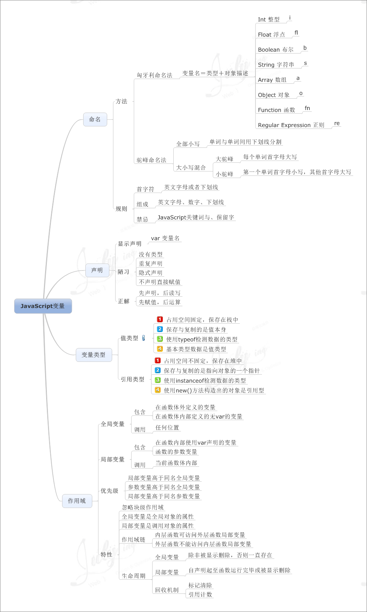
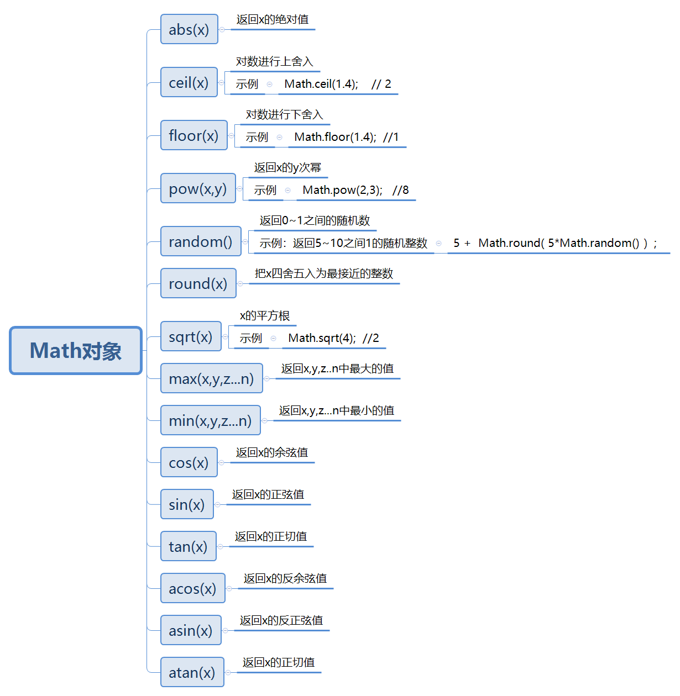
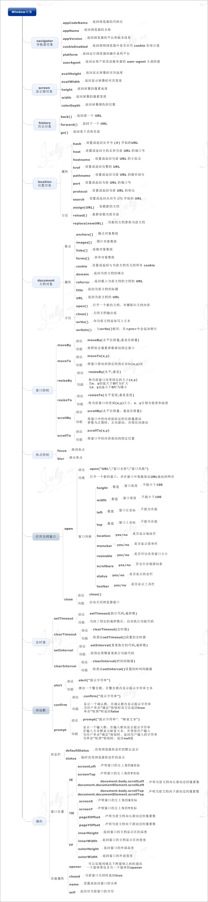
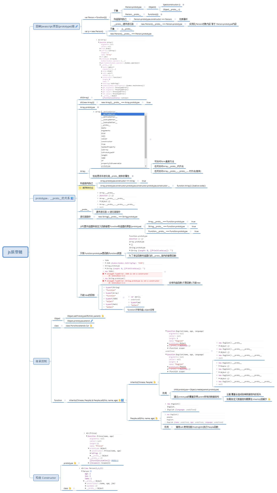

# Javascript
* [基础](#基础)
    - [概念](#概念)
    - [组成](#组成)
    - [基本用法](#基本用法)
    - [ES6](#ES6)
* [进阶](#进阶)
    - [易混淆概念](#易混淆概念)
    - [call apply bind](#call-apply-bind)
    - [原型链](#原型链)
* [常见问题](#常见问题)
* [参考资料](#参考资料)  

## 概念

- JavaScript是一种轻量级的脚本语言。所谓“脚本语言”，指的是它不具备开发操作系统的能力，而是只用来编写控制其他大型应用程序的“脚本”。

- JavaScript是一种嵌入式（embedded）语言。它本身提供的核心语法，规模相当小，只能用来做一些数学和逻辑运算。JavaScript本身不提供任何与I/O（输入/输出）相关的API，都要靠宿主环境（host）提供，所以JavaScript只合适嵌入更大型的应用程序环境，去调用宿主环境提供的底层API。

- 目前，已经嵌入JavaScript的宿主环境有多种，最常见的环境就是浏览器，另外还有服务器环境，也就是Node项目。

- 从语法角度看，JavaScript语言是一种“对象模型”语言。各种宿主环境通过这个模型，描述自己的功能和操作接口，从而通过JavaScript控制这些功能。但是，JavaScript并不是纯粹的“面向对象语言”，还支持函数式编程。这导致几乎任何一个问题，JavaScript都有多种解决方法。

## JavaScript组成
- 核心（ECMAScript）
- 文档对象模型（DOM）
- 浏览器对象模型（BOM）

## 基本用法
### 1. 数据类型

### 2. 变量

### 3. 运算符

### 4. 流程语句

### 5. 数组

### 6. 字符串函数

### 7. Date 对象

### 8. Math 对象

### 9. 函数基础

### 10. 正则表达式

### 11. DOM基本操作

### 12. Event事件

### 13. window对象

## ES6

### 1. let

### 2. const

### 3. destructuring

### 4. 字符串的扩展

### 5. 数值的扩展

### 6. 对象的扩展

### 7. Promise

## 进阶概念

### 易混淆概念

### call apply bind

### 原型链

## 常见问题
- [问答](https://blog.csdn.net/swallowblank/article/details/90703030?utm_medium=distribute.pc_relevant.none-task-blog-baidujs_title-6&spm=1001.2101.3001.4242)

## 参考资料
- [菜鸟教程](https://www.runoob.com//-tutorial.html)
- [W3C](https://www.w3cschool.cn/javascript/)
- [廖雪峰](https://www.liaoxuefeng.com/wiki/1022910821149312)
- [思维导图地址1](https://blog.csdn.net/robin_star_/article/details/78719658)
- [思维导图地址2](https://blog.csdn.net/a790012863/article/details/80145393?utm_medium=distribute.pc_relevant.none-task-blog-BlogCommendFromBaidu-7.control&dist_request_id=5e01f07d-e6d7-4e53-8ba7-ab18e405c4ce&depth_1-utm_source=distribute.pc_relevant.none-task-blog-BlogCommendFromBaidu-7.control)
- js总体概览
