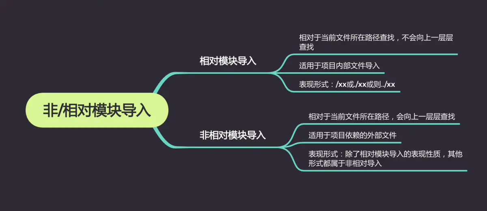
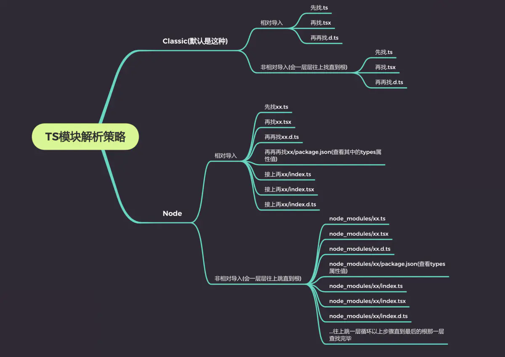

# Typescript
* [快速上手](#快速上手)
* [基础用法](#基础用法)
    - [基础类型](#基础类型)
    - [接口](#接口)
    - [类](#类)
    - [函数](#函数)
    - [泛型](#泛型)
    - [枚举](#枚举)
    - [高级类型](#高级类型)
    - [模块](#模块)
* [进阶](#进阶)
    - [模块解析](#模块解析)
    - [命名空间](#命名空间)
    - [命名空间和模块](#命名空间和解析)
    - [声明合并](#声明合并)
    - [装饰器](#装饰器)
    - [Mixins](#Mixins)
    - [三斜线指令](#三斜线指令)
    - [Javascript文件类型检查](#Javascript文件类型检查)
* [规范](#规范)
* [常见问题](#常见问题)
* [参考资料](#参考资料)  
* [图示总结](#图示总结)  

## 快速上手

https://www.typescriptlang.org/docs/handbook/typescript-tooling-in-5-minutes.html

## 基本用法

### 基础类型

1. 布尔值
```
let isDone: boolean = false;
```
2. 数字
    > 支持二进制、八进制、十进制和十六进制字面量
```
let decLiteral: number = 6;
let hexLiteral: number = 0xf00d;
let binaryLiteral: number = 0b1010;
let octalLiteral: number = 0o744;
```
3. 字符串
    > 支持模板字符串
```
let name: string = "bob";

let name: string = `Gene`;
let age: number = 37;
let sentence: string = `Hello, my name is ${ name }.

I'll be ${ age + 1 } years old next month.`;
```
4. 数组
```
let list: number[] = [1, 2, 3];

let list: Array<number> = [1, 2, 3];
```
5. 元组 Tuple
```
let x: [string, number];
// Initialize it
x = ['hello', 10]; // OK
// Initialize it incorrectly
x = [10, 'hello']; // Error
当访问一个已知索引的元素，会得到正确的类型：

console.log(x[0].substr(1)); // OK
console.log(x[1].substr(1)); // Error, 'number' does not have 'substr'
当访问一个越界的元素，会使用联合类型替代：

x[3] = 'world'; // OK, 字符串可以赋值给(string | number)类型

console.log(x[5].toString()); // OK, 'string' 和 'number' 都有 toString

x[6] = true; // Error, 布尔不是(string | number)类型
联合类型是高级主题，我们会在以后的章节里讨论它。
```
6. 枚举
```
enum Color {Red, Green, Blue}
let c: Color = Color.Green;
```
7. Any
```
let notSure: any = 4;
notSure = "maybe a string instead";
notSure = false; // okay, definitely a boolean
```
8. Void
    > 表示没有任何类型,只能为它赋予undefined和null
```
// 当一个函数没有返回值时，你通常会见到其返回值类型是 void
function warnUser(): void {
    console.log("This is my warning message");
}

let unusable: void = undefined;
let unusable: void = void;
```
9. Null 和 Undefined
    > 默认情况下null和undefined是所有类型的子类型
```
let u: undefined = undefined;
let n: null = null;
```
10. Never
    > 表示永不存在的值的类型。
    
    
    1. never类型是那些总是会抛出异常或根本就不会有返回值的函数表达式或箭头函数表达式的返回值类型； 变量也可能是 never类型，当它们被永不为真的类型保护所约束时。

    2. never类型是任何类型的子类型，也可以赋值给任何类型；然而，没有类型是never的子类型或可以赋值给never类型（除了never本身之外）。 即使 any也不可以赋值给never。
```
// 返回never的函数必须存在无法达到的终点
function error(message: string): never {
    throw new Error(message);


// 返回never的函数必须存在无法达到的终点
function infiniteLoop(): never {
    while (true) {
    }
}
```
11. Object
```
declare function create(o: object | null): void;

create({ prop: 0 });
create(null);
```

### 接口

    为这些类型命名和为你的代码或第三方代码定义契约。

1. 可选属性
    > 在可选属性名字定义的后面加一个?符号。
    
    ```
    interface LabelledValue {
        label?: string
    }
    
    let myObj: LabelledValue = {label: "Size 10 Object"};
    // or
    let myObj: LabelledValue = {};
    ```

2. 只读属性
    >  在属性名前用 readonly来指定只读属性:

    ```
    interface LabelledValue {
        readonly size: number
    }

    let myObj: LabelledValue = {size: 10};
    myObj.size = 20; // Error, 只读属性第一次被赋值后， 就再也不能被改变了。
    ```

3. 函数类型
    >  为了使用接口表示函数类型，我们需要给接口定义一个调用签名。它就像是一个只有参数列表和返回值类型的函数定义。参数列表里的每个参数都需要名字和类型。

    ```
    interface SearchFunc {
        (source: string, subString: string): boolean;
    }
    
    let mySearch: SearchFunc = function(source: string, subString: string) {
        let result = source.search(subString);
        return result > -1;
    }
    ```

    注意： ==函数的参数名不需要与接口里定义的名字相匹配==

    ```
    let mySearch = function(src: string, sub: string): boolean {
      let result = src.search(sub);
      return result > -1;
    }
    ```

4. 可索引类型
    > 描述那些能够“通过索引得到”的类型
    
    > 支持两种索引签名：字符串和数字
    
    ```
    interface StringArray {
        [index: number]: string;
    }
    
    let myArray: StringArray = ["Bob", "Fred"];
    ```

5. 类类型
    > 强制一个类去符合某种契约。

    ```
    interface ClockInterface {
        currentTime: Date;
        setTime(d: Date);
    }
    
    class Clock implements ClockInterface {
        currentTime: Date;
        setTime(d: Date) {
            this.currentTime = d;
        }
        constructor(h: number, m: number) { }
    }
    ```

6. 继承接口
    > 接口可以相互继承

    ```
    interface Shape {
        color: string;
    }
    
    interface Square extends Shape {
        sideLength: number;
    }
    
    let square = <Square>{};
    square.color = "blue";
    square.sideLength = 10;
    ```
7. 接口继承类
    ```
    class Control {
        private state: any;
    }
    
    interface SelectableControl extends Control {
        select(): void;
    }
    
    class Button extends Control implements SelectableControl {
        select() { }
    }
    
    // 错误：“Image”类型缺少“state”属性。
    class Image implements SelectableControl {
        select() { }
    }
    ```

### 类

#### 修饰符
- public：默认，可以自由的访问程序里定义的成员
- private：不能在声明它的类的外部访问
- protected：protected成员在派生类中仍然可以访问
- readonly：只读属性必须在声明时或构造函数里被初始化
- 静态属性：使用static，想要访问这个属性的时候，都要在 origin前面加上类名

```

class Parent {
    public name: string;
    private age: number;
    protected sex: string;
    
    constructor(name: string, age: number, sex: string) { 
        this.name = name;
        this.age = age; 
        this.sex = sex;
    }
}

class Animal extends Parent {
    readonly numberOfLegs: number;
    static origin = {x: 0, y: 0};
    
    constructor(name: string, age: number, sex: string, numberOfLegs) { 
       super(name, age, sex);
       this.numberOfLegs = numberOfLegs;
    }
    
    getElevatorPitch() {
        return `Hello, my name is ${this.name} and I work in ${this.department}.`;
    }
}

const animal = new Animal("Cat", 20, 'boy', 8);
animal.name; 
animal.age; // Error: 'age' 是私有的.
animal.sex; // Error
animal.numberOfLegs = 3; // Error
```

### 函数

1. 类型：包含参数类型和返回值类型。
```
let myAdd: (x: number, y: number) => number =
    function(x: number, y: number): number { return x + y; };

// 完整函数类型
let myAdd: (baseValue: number, increment: number) => number =
    function(x: number, y: number): number { return x + y; };
```

2. 可选参数
```
function buildName(firstName: string, lastName?: string) {
  return firstName;
}

let employeeName = buildName("Joseph", "Samuel");
```
3. 默认参数
```
function buildName(firstName: string = 'Joseph') {
  return firstName;
}

let employeeName1 = buildName();
let employeeName2 = buildName('Samuel');
```
4. 剩余参数
```
function buildName(firstName: string, ...restOfName: string[]) {
  return firstName + " " + restOfName.join(" ");
}

let employeeName = buildName("Joseph", "Samuel", "Lucas", "MacKinzie");
```
5. 重载: 根据传入的参数不同返回不同的值
```
let suits = ["hearts", "spades", "clubs", "diamonds"];

function pickCard(x: {suit: string; card: number; }[]): number;
function pickCard(x: number): {suit: string; card: number; };
function pickCard(x): any {
    // Check to see if we're working with an object/array
    // if so, they gave us the deck and we'll pick the card
    if (typeof x == "object") {
        let pickedCard = Math.floor(Math.random() * x.length);
        return pickedCard;
    }
    // Otherwise just let them pick the card
    else if (typeof x == "number") {
        let pickedSuit = Math.floor(x / 13);
        return { suit: suits[pickedSuit], card: x % 13 };
    }
}

let myDeck = [{ suit: "diamonds", card: 2 }, { suit: "spades", card: 10 }, { suit: "hearts", card: 4 }];
let pickedCard1 = myDeck[pickCard(myDeck)];
alert("card: " + pickedCard1.card + " of " + pickedCard1.suit);

let pickedCard2 = pickCard(15);
alert("card: " + pickedCard2.card + " of " + pickedCard2.suit);
```


### 泛型
    > 使返回值的类型与传入参数的类型是相同的, 但类型不是固定的

1. 泛型变量
```
function identity<T>(arg: T): T {
    return arg;
}
```
2. 泛型类
```
class GenericNumber<T> {
    zeroValue: T;
    add: (x: T, y: T) => T;
}

let myGenericNumber = new GenericNumber<number>();
myGenericNumber.zeroValue = 0;
myGenericNumber.add = function(x, y) { return x + y; };
```

### 枚举
    
    > 通过枚举的属性来访问枚举成员，和枚举的名字来访问枚举类型
    
```
enum Response {
    No = 0,
    Yes = 1,
}

function respond(recipient: string, message: Response): void {
    // ...
}

respond("Princess Caroline", Response.Yes)
```

1. 枚举
    - 数字枚举: 第一个成员的默认值为0，其他的成员从第一个成员的值开始自动增长
    
    ```
    enum Direction {
        Up = 1,
        Down,
        Left,
        Right
    }
    ```
    
    - 字符串枚举
    
    ```
    enum Direction {
        Up = "UP",
        Down = "DOWN",
        Left = "LEFT",
        Right = "RIGHT",
    }
    ```
    
    - 异构枚举

    ```
    enum BooleanLikeHeterogeneousEnum {
        No = 0,
        Yes = "YES",
    }
    ```
2. 外部枚举
    > 使用declare
```
declare enum Enum {
    A = 1,
    B,
    C = 2
}
```
3. 反向映射
```
enum Enum {
    A
}
let a = Enum.A;
let nameOfA = Enum[a]; // "A"
```

### 高级类型

1. 交叉类型
    > 将多个类型合并为一个类型
    
    ```
    function extend<T, U>(first: T, second: U): T & U {
        // ...
    }
    ```
    
2. 联合类型
    > 满足其中一个类型

    ```
    function padLeft(value: string, padding: string | number) {
        // ...
    }
    ```
    
    - ==如果一个值是联合类型，我们只能访问此联合类型的所有类型里共有的成员==
    
3. 类型别名
    > 给一个类型起个新名字. 它可以作用于原始值，联合类型，元组以及其它任何你需要手写的类型。起别名不会新建一个类型, 它创建了一个新名字来引用那个类型。 

    ```
    type Name = string;
    type NameResolver = () => string;
    type NameOrResolver = Name | NameResolver;
    function getName(n: NameOrResolver): Name {
        if (typeof n === 'string') {
            return n;
        }
        else {
            return n();
        }
    }
    type Container<T> = { value: T };
    ```
    
    - 注意: ==类型别名不能出现在声明右侧的任何地方==
    
    ```
    type Yikes = Array<Yikes>; // error
    ```

### 模块

1. 导出: export
```
export interface StringValidator {
    isAcceptable(s: string): boolean;
}

export const numberRegexp = /^[0-9]+$/;

// or 

interface StringValidator {
    isAcceptable(s: string): boolean;
}

const numberRegexp = /^[0-9]+$/;

export {
    StringValidator,
    numberRegexp,
}
```

2. 导入: import
```
import { ZipCodeValidator } from "./ZipCodeValidator";

import { ZipCodeValidator as ZCV } from "./ZipCodeValidator";

import * as validator from "./ZipCodeValidator";
// validator.ZipCodeValidator
```

3. 默认
```
let $: JQuery;
export default $;

import $ from 'Jquery';
```

## 进阶

### 模块解析 
    
https://www.tslang.cn/docs/handbook/module-resolution.html





### 命名空间
    > 主要用于组织代码，以便于在记录他们类型的同时还担心与其他对象命名冲突


### 命名空间和模块

命名空间主要是解决命名冲突.

模块提供了更好的代码重用，更强的封闭性以及更好的使用工具进行优化。

对于Node.js应用来说，模块是默认并推荐的组织代码的方式。


- 命名空间和模块的陷阱
    - 对模块使用/// <reference>
    - 不必要的命名空间

### 声明合并

#### 接口合并
    
    ```
    interface Cloner {
        clone(animal: Animal): Animal;
    }
    
    interface Cloner {
        clone(animal: Sheep): Sheep;
    }
    
    interface Cloner {
        clone(animal: Dog): Dog;
        clone(animal: Cat): Cat;
    }
    
    // 合并后
    interface Cloner {
        clone(animal: Dog): Dog;
        clone(animal: Cat): Cat;
        clone(animal: Sheep): Sheep;
        clone(animal: Animal): Animal;
    }
    
    ```
    
 + ==注意==
    - 接口的非函数的成员应该是唯一的。如果它们不是唯一的，那么它们必须是相同的类型。如果两个接口中同时声明了同名的非函数成员且它们的类型不同，则编译器会报错==
    - 每组接口里的声明顺序保持不变，但各组接口之间的顺序是后来的接口重载出现在靠前位置
    - 当出现特殊的函数签名时。 如果签名里有一个参数的类型是 单一的字符串字面量（比如，不是字符串字面量的联合类型），那么它将会被提升到重载列表的最顶端
    
```
interface Document {
    createElement(tagName: any): Element;
}
interface Document {
    createElement(tagName: "div"): HTMLDivElement;
    createElement(tagName: "span"): HTMLSpanElement;
}
interface Document {
    createElement(tagName: string): HTMLElement;
    createElement(tagName: "canvas"): HTMLCanvasElement;
}

// 合并后
interface Document {
    createElement(tagName: "canvas"): HTMLCanvasElement;
    createElement(tagName: "div"): HTMLDivElement;
    createElement(tagName: "span"): HTMLSpanElement;
    createElement(tagName: string): HTMLElement;
    createElement(tagName: any): Element;
}
```
    
#### 命名空间合并

```
namespace Animals {
    export class Zebra { }
}

namespace Animals {
    export interface Legged { numberOfLegs: number; }
    export class Dog { }
}

// 合并后
namespace Animals {
    export interface Legged { numberOfLegs: number; }

    export class Zebra { }
    export class Dog { }
}
```

注意:  ==非导出成员仅在其原有的（合并前的）命名空间内可见。这就是说合并之后，从其它命名空间合并进来的成员无法访问非导出成员==

```
namespace Animal {
    let haveMuscles = true;

    export function animalsHaveMuscles() {
        return haveMuscles;
    }
}

namespace Animal {
    export function doAnimalsHaveMuscles() {
        return haveMuscles;  // Error, because haveMuscles is not accessible here
    }
}
```

### 装饰器
    > 为我们在类的声明及成员上通过元编程语法添加标注提供了一种方式

#### 启用

1. 命令行: `tsc --target ES5 --experimentalDecorators`
2. tsConfig:
```
{
    "compilerOptions": {
        "target": "ES5",
        "experimentalDecorators": true
    }
}
```

#### 装饰器

1. 装饰器工厂
    > 返回一个表达式，以供装饰器在运行时调用

```
function color(value: string) { // 这是一个装饰器工厂
    return function (target) { //  这是装饰器
        // do something with "target" and "value"...
    }
}
```

2. 装饰器组合
    > 多个装饰器可以同时应用到一个声明上

```
@f @g x
```

3. 装饰器求值


    类中不同声明上的装饰器将按以下规定的顺序应用:
    1. 参数装饰器，然后依次是方法装饰器，访问符装饰器，或属性装饰器应用到每个实例成员。
    2. 参数装饰器，然后依次是方法装饰器，访问符装饰器，或属性装饰器应用到每个静态成员。
    3. 参数装饰器应用到构造函数。
    4. 类装饰器应用到类。

4. 类装饰器
    > 在类声明之前被声明（紧靠着类声明）。 类装饰器应用于类构造函数，可以用来监视，修改或替换类定义

```
@sealed
class Greeter {

}
```

5. 方法装饰器
    > 声明在一个方法的声明之前（紧靠着方法声明）。 它会被应用到方法的 属性描述符上，可以用来监视，修改或者替换方法定义

```
class Greeter {
    greeting: string;
    constructor(message: string) {
        this.greeting = message;
    }

    @enumerable(false)
    greet() {
        return "Hello, " + this.greeting;
    }
}
```

6. 访问器装饰器
    > 声明在一个访问器的声明之前（紧靠着访问器声明）。 访问器装饰器应用于访问器的 属性描述符并且可以用来监视，修改或替换一个访问器的定义

```
class Point {
    private _x: number;
    constructor(x: number) {
        this._x = x;
    }

    @configurable(false)
    get x() { return this._x; }
}
```

7. 属性装饰器
    > 声明在一个属性声明之前（紧靠着属性声明）

```
class Greeter {
    @format("Hello, %s")
    greeting: string;

    constructor(message: string) {
        this.greeting = message;
    }
}
```

8. 参数装饰器
    > 声明在一个参数声明之前（紧靠着参数声明）。 参数装饰器应用于类构造函数或方法声明

```
class Greeter {
    greeting: string;

    constructor(message: string) {
        this.greeting = message;
    }

    @validate
    greet(@required name: string) {
        return "Hello " + name + ", " + this.greeting;
    }
}
```
### Mixins
    > mixins是面向对象编程里比较重要的概念，根据功能定义多个可复用mixins类，使子类能够继承根据功能继承需要的mixins。scala里的trait即实现了混入并且应用广泛。typescript原生不支持混入，但可通过语法组合实现。

https://www.tslang.cn/docs/handbook/mixins.html

### 三斜线指令
    三斜线指令是包含单个XML标签的单行注释。 注释的内容会做为编译器指令使用。
    
    - ==三斜线指令仅可放在包含它的文件的最顶端==

1. `/// <reference path="..." />`: 声明文件间的依赖
2. `/// <reference types="..." />`: 声明对某个包的依赖
3. `/// <reference no-default-lib="true"/>`: 把一个文件标记成默认库
4. `/// <amd-module />`: 允许给编译器传入一个可选的模块名

### Javascript文件类型检查

https://www.tslang.cn/docs/handbook/type-checking-javascript-files.html

## 规范

https://www.tslang.cn/docs/handbook/declaration-files/do-s-and-don-ts.html

## 常见问题
1. [TS 中的 never 类型具体有什么用?](https://cloud.tencent.com/developer/article/1594872)

2. readonlye和const的区别?
    > 最简单判断该用readonly还是const的方法是看要把它做为变量使用还是做为一个属性。 做为变量使用的话用 const，若做为属性则使用readonly。


3. 常量枚举和常规枚举的区别？
    > 常量枚举只能使用常量枚举表达式，并且不同于常规的枚举，它们在编译阶段会被删除。 常量枚举成员在使用的地方会被内联进来。 之所以可以这么做是因为，常量枚举不允许包含计算成员。

    ```
    const enum Directions {
        Up,
        Down,
        Left,
        Right
    }
    
    let directions = [Directions.Up, Directions.Down, Directions.Left, Directions.Right];
    
    // 生成后的代码为：
    var directions = [0 /* Up */, 1 /* Down */, 2 /* Left */, 3 /* Right */];
    ```
    
4. 接口和类型别名的区别?
    
    interface | type
    ---|---
    接口创建了一个新的名字，可以在其它任何地方使用 | 类型别名并不创建新名字
    能被 extends和 implements | 不能
    不可以 | 可以描述一个类型并且需要使用联合类型或元组类型

5. Typescript中的模块是什么？

    Typescript1.5后为了与ES6术语保持一致，内部模块都称为命名空间，外部模块简称模块。

    模块在自身的作用域里执行，并不是全局作用域。这就意味着模块类的类、函数、对象等对外都是不可见的。除非你通过export导出，import导入。

    模块通过使用模块加载器导入另一个模块。在运行时，模块加载器负责在执行模块之前定位和执行模块的所有依赖项。JavaScript中最常用的模块加载器是用于Node.js的CommonJS模块加载器和用于Web应用程序的require.js模块加载器。

    特别说明：

    为了支持CommonJS和AMD语法中的exports，TS提供了export = 语法，引入方式为import xxx = require("xxx")；

6. 什么是Mixins?
    
    一种通过重用组件构建类的方法。

    不通过类的直接继承来实现，而是将基类作为接口来实现。对于基类实例化部分在子类中实现，基类中原型的部分在子类中进行声明占位，然后通过一个Minxin函数将基类上的原型属性拷贝到子类上。

7.  Declare关键字是干嘛用的？

    我们在.ts中使用的第三方库时没有.d.ts声明文件的时候，我们可以通过declare来写申明文件。

    可以声明该模块，甚至可以直接声明一个值为any的同名的变量，然后我们就可以在代码中直接使用该三方库了。

    https://www.tslang.cn/docs/handbook/declaration-files/by-example.html

8. 什么是类型断言？

    类型断言对运行没有什么影响，仅供编译器使用。

    向编译器提供我们所希望的分析代码的提示。

    表示断言的两种方式：

    1：<类型>变量

    2：变量 as 类型 （在tsx中只能使用这种方式）

9. Typescript 4.0新增变化

    https://www.typescriptlang.org/docs/handbook/release-notes/typescript-4-0.html

10. Typescript 4.1新增变化

    https://www.typescriptlang.org/docs/handbook/release-notes/typescript-4-1.html
    
## 参考资料

1. [官方文档](https://www.tslang.cn/docs/handbook/basic-types.html)
