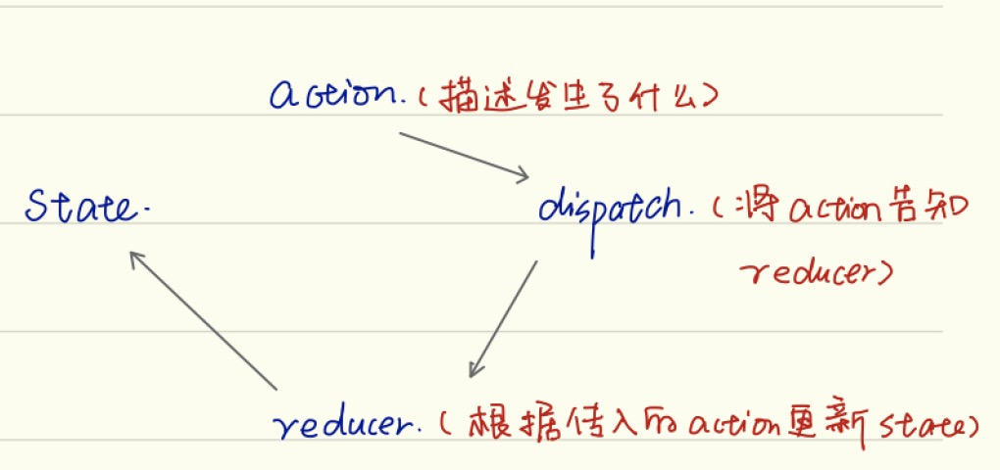

# 框架

* [Redux状态管理](https://redux.js.org/introduction/getting-started)
    - [核心概念](#核心概念)
        - [Action](#Action)
        - [Action Creators](#ActionCreators)
        - [Reducers](#Reducers)
        - [Store](#Store)
        - [Dispatch](#Dispatch)
        - [Selectors](#Selectors)
    - [使用React Toolkit](#使用ReactToolkit)
* [Antd框架](#Antd框架)
* [常见问题](#常见问题)
* [参考资料](#参考资料)  


## 核心概念
The only way to change the state tree is to create an action, an object describing what happened, and dispatch it to the store.

To specify how state gets update in response to an action, you write pure reducer functions that cacluate a new state based on the old state and the action.



### Action
A plain Javascript object that has a type field.You can think of an action as an event that describes something that happened in the application.
- type(domian/eventName)
    - domain : The feature or category that this action belongs to.
    - eventName : The specific thing that happened.
- payload
    - An action object can have other fileds with additional information about what happened.

```javascript
const addTodoAction = {
    type: 'todos/todoAdded',
    payload: 'Buy milk'
}
```

### ActionCreators

### Reducers
A reducer is a function that receives the current state and an action object, decides how to update the state if necessary, and return the new state.

The logic inside reducer functions typically follows the same series of steps:
1. Check to see if the reducer cares about this action. If so, make a copy of the state, update the copy with new values, and return it.

2. Otherwise, return the existing state unchange.

```javascript
const initialState = {
    value: 0
}

function counterReducer(state = initialState, action){
    if(action.type === 'counter/increment'){
        return {
            ...state,
            value: state.value + 1
        }
    }
    return state
}
```

### Store
The current Redux application state live in an object called the store.

The store is created by passing in a reducer, and has a method called getState that returns the current state value.

```javascript
import { configStore } from '@reactjs/toolkit'

const store = configStore({
    reducer: counterReducer
})

console.log(store.getState())
```

### Dispatch
The Redux state has a method called dispatch. The only way to update the state is to call `store.dispatch` and pass in an action object. The store will run its reducer function and save the new state value inside, and we can call `getState()` to retrieve the update value.

```javascript
const increment = () => {
    return {
        type: 'counter/increment'
    }
}

store.dispatch(increment())
console.log(store.getState())
```

### Selectors
Selectors are functions that know how to extract specific pieces of information from a store state value. As an application grows bigger, this can help avoid repeating logic as different parts of the app need to read the same data.

```javascript
const selectCounterValue = state => state.value
const currentValue = selectCounterValue(store.getState())
```

## 使用ReactToolkit

### Example
```javascript
import { createSlice, configureStore } from '@reduxjs/toolkit'
const counterSlice = createSlice({
    name: 'counter',
    initialstate: {
        value: 0
    },
    reducer: {
        incremented: state => {
            state.value += 1
        },
        decremented: state => {
            state.value -= 1
        }
    }
})

export const { incremented, decremented } = counterSlice.actions

const store = configureStore({
    reducer: counterSlice.reducer
})

store.subscribe(() => console.log(store.getstate()))

store.dispatch(incremented)
store.dispatch(decremented)
```

