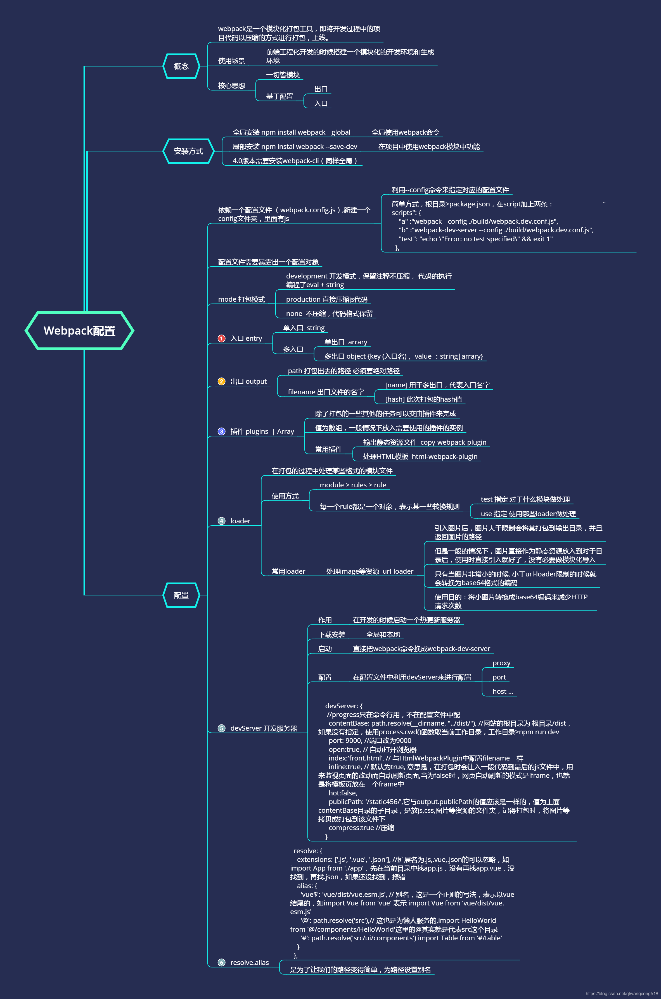

# Webpack

* [快速开始](#快速开始)
    - [简介](#简介)
    - [安装](#安装)
    - [使用](#使用)
* [基础](#基础)
    - [核心概念](#概念)
    - [配置](#配置)
* [进阶](#进阶)
    - [API](#API)
    - [loaders](#loaders)
    - [plugins](#plugins)
* [常见问题](#常见问题)
* [参考链接](#参考链接)

## 快速开始

### 简介
Webpack 是一个前端资源加载/打包工具。它将根据模块的依赖关系进行静态分析，然后将这些模块按照指定的规则生成对应的静态资源。


### 安装

`npm install webpack -g`

### 使用

`webpack runoob1.js bundle.js`

执行以上命令会编译 runoob1.js 文件并生成bundle.js 文件，成功后输出信息如下所示：
```
Hash: a41c6217554e666594cb
Version: webpack 1.12.13
Time: 50ms
    Asset     Size  Chunks             Chunk Names
bundle.js  1.42 kB       0  [emitted]  main
   [0] ./runoob1.js 29 bytes {0} [built]
```

## 基础

### [概念](https://www.webpackjs.com/concepts/)


#### 基础配置

```javascript
// webpack.config.js

var path = require('path');

module.exports = {
  mode: 'development',
  entry: './foo.js',
  output: {
    path: path.resolve(__dirname, 'dist'),
    filename: 'foo.bundle.js'
  }
};
```

#### [Manifest](https://www.webpackjs.com/concepts/manifest/)

#### [构建目标](https://www.webpackjs.com/concepts/targets/)

1. 用法

要设置 target 属性，只需要在你的 webpack 配置中设置 target 的值。
```javascript
// webpack.config.js

module.exports = {
  target: 'node'
};
```

2. 多个 Target

通过打包两份分离的配置来创建同构的库：
```javascript
// webpack.config.js

var path = require('path');
var serverConfig = {
  target: 'node',
  output: {
    path: path.resolve(__dirname, 'dist'),
    filename: 'lib.node.js'
  }
  //…
};

var clientConfig = {
  target: 'web', // <=== 默认是 'web'，可省略
  output: {
    path: path.resolve(__dirname, 'dist'),
    filename: 'lib.js'
  }
  //…
};

module.exports = [ serverConfig, clientConfig ];
```

#### [模块热替换](https://www.webpackjs.com/concepts/hot-module-replacement/)


### [配置](https://www.webpackjs.com/configuration/)



## 进阶


### [API](https://www.webpackjs.com/api/)

### [loaders](https://www.webpackjs.com/loaders/)


### [plugins](https://www.webpackjs.com/plugins/)

## 常见问题

1. webpack与grunt、gulp的不同？

    三者都是前端构建工具，grunt和gulp在早期比较流行，现在webpack相对来说比较主流，不过一些轻量化的任务还是会用gulp来处理，比如单独打包CSS文件等
    
    grunt和gulp是基于任务和流（Task、Stream）的。类似jQuery，找到一个（或一类）文件，对其做一系列链式操作，更新流上的数据， 整条链式操作构成了一个任务，多个任务就构成了整个web的构建流程。
    
    webpack是基于入口的。webpack会自动地递归解析入口所需要加载的所有资源文件，然后用不同的Loader来处理不同的文件，用Plugin来扩展webpack功能。
    
    所以总结一下：
    
    从构建思路来说
    gulp和grunt需要开发者将整个前端构建过程拆分成多个Task，并合理控制所有Task的调用关系
    webpack需要开发者找到入口，并需要清楚对于不同的资源应该使用什么Loader做何种解析和加工
    
    对于知识背景来说
    gulp更像后端开发者的思路，需要对于整个流程了如指掌 webpack更倾向于前端开发者的思路

2. Loader和Plugin的不同？


    - 不同的作用

        Loader直译为"加载器"。Webpack将一切文件视为模块，但是webpack原生是只能解析js文件，如果想将其他文件也打包的话，就会用到loader。 所以Loader的作用是让webpack拥有了加载和解析非JavaScript文件的能力
        
        Plugin直译为"插件"。Plugin可以扩展webpack的功能，让webpack具有更多的灵活性。 在 Webpack
        运行的生命周期中会广播出许多事件，Plugin 可以监听这些事件，在合适的时机通过 Webpack 提供的 API 改变输出结果。

    - 不同的用法

        Loader在module.rules中配置，也就是说他作为模块的解析规则而存在。
        类型为数组，每一项都是一个Object，里面描述了对于什么类型的文件（test），使用什么加载(loader)和使用的参数（options）
        
        Plugin在plugins中单独配置。 类型为数组，每一项是一个plugin的实例，参数都通过构造函数传入。

3. webpack的构建流程是什么?从读取配置到输出文件这个过程尽量说全

    Webpack 的运行流程是一个串行的过程，从启动到结束会依次执行以下流程：

    - 初始化参数：从配置文件和 Shell 语句中读取与合并参数，得出最终的参数；
    - 开始编译：用上一步得到的参数初始化 Compiler 对象，加载所有配置的插件，执行对象的 run 方法开始执行编译；
    - 确定入口：根据配置中的 entry 找出所有的入口文件；
    - 编译模块：从入口文件出发，调用所有配置的 Loader
    对模块进行翻译，再找出该模块依赖的模块，再递归本步骤直到所有入口依赖的文件都经过了本步骤的处理；
    - 完成模块编译：在经过第4步使用 Loader 翻译完所有模块后，得到了每个模块被翻译后的最终内容以及它们之间的依赖关系；
    - 输出资源：根据入口和模块之间的依赖关系，组装成一个个包含多个模块的 Chunk，再把每个 Chunk
    转换成一个单独的文件加入到输出列表，这步是可以修改输出内容的最后机会；
    - 输出完成：在确定好输出内容后，根据配置确定输出的路径和文件名，把文件内容写入到文件系统。
        
    在以上过程中，Webpack 会在特定的时间点广播出特定的事件，插件在监听到感兴趣的事件后会执行特定的逻辑，并且插件可以调用 Webpack 提供的 API 改变 Webpack 的运行结果。

4. webpack的热更新是如何做到的？说明其原理？
5. 如何利用webpack来优化前端性能？（提高性能和体验）

    用webpack优化前端性能是指优化webpack的输出结果，让打包的最终结果在浏览器运行快速高效。

    - 压缩代码。删除多余的代码、注释、简化代码的写法等等方式。可以利用webpack的UglifyJsPlugin和ParallelUglifyPlugin来压缩JS文件，利用cssnano（css-loader?minimize）来压缩css
    - 利用CDN加速。在构建过程中，将引用的静态资源路径修改为CDN上对应的路径。可以利用webpack对于output参数和各loader的publicPath参数来修改资源路径
    - 删除死代码（Tree
    Shaking）。将代码中永远不会走到的片段删除掉。可以通过在启动webpack时追加参数–optimize-minimize来实现
    - 提取公共代码。
    
6.如何提高webpack的构建速度？

    - 多入口情况下，使用CommonsChunkPlugin来提取公共代码
    - 通过externals配置来提取常用库
    - 利用DllPlugin和DllReferencePlugin预编译资源模块，通过DllPlugin来对那些我们引用但是绝对不会修改的npm包来进行预编译，再通过DllReferencePlugin将预编译的模块加载进来。
    - 使用Happypack 实现多线程加速编译
    - 使用webpack-uglify-parallel来提升uglifyPlugin的压缩速度。原理上webpack-uglify-parallel采用了多核并行压缩来提升压缩速度
    - 使用Tree-shaking和Scope Hoisting来剔除多余代码

## 参考链接

1. https://www.webpackjs.com/concepts/
2. https://aotu.io/notes/2020/07/17/webpack-analize/index.html
3. https://my.oschina.net/u/4676704/blog/4641134
4. https://zhuanlan.zhihu.com/p/30669007
